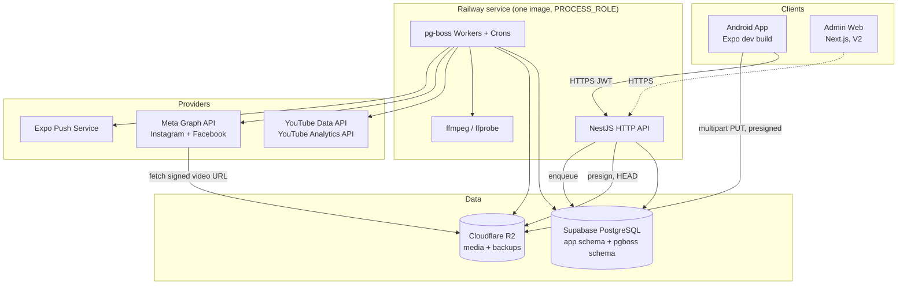
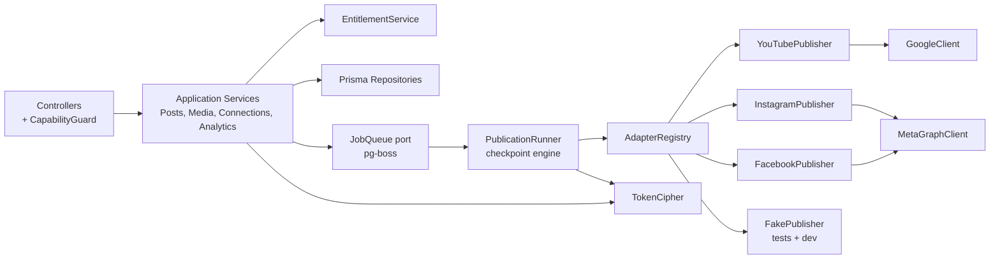
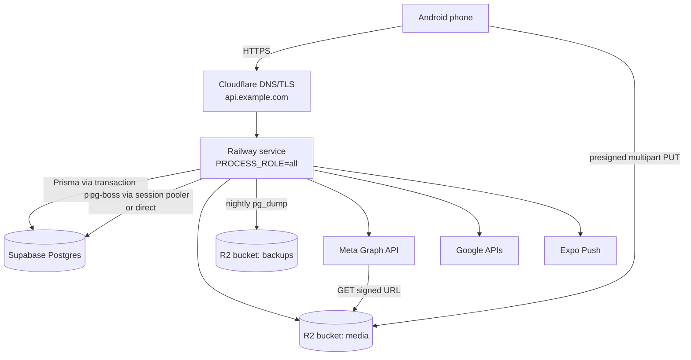
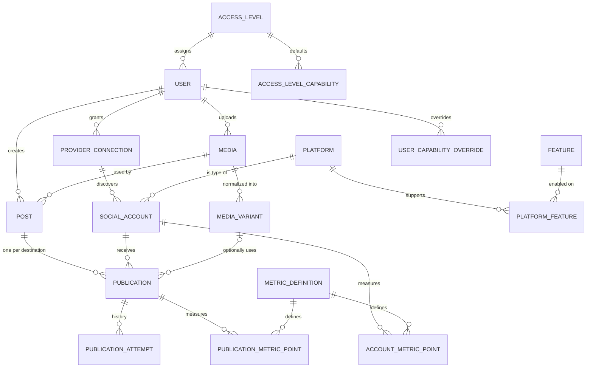
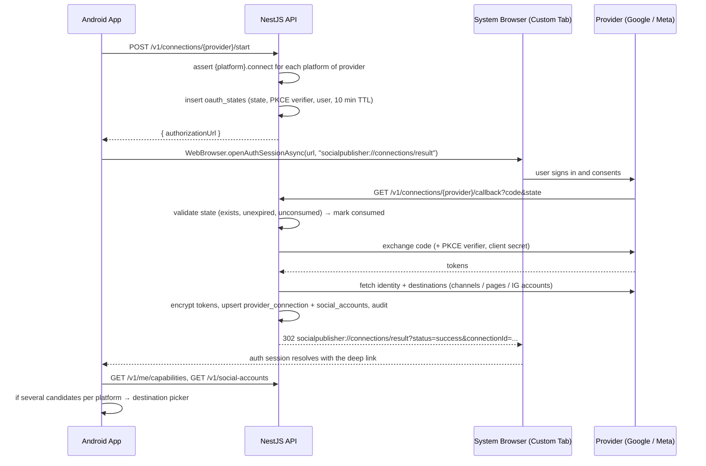
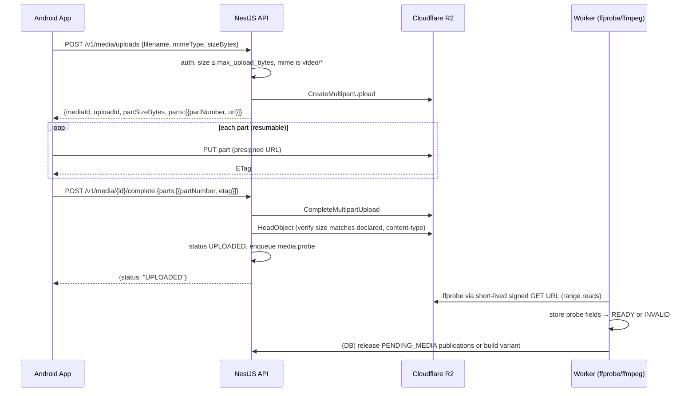
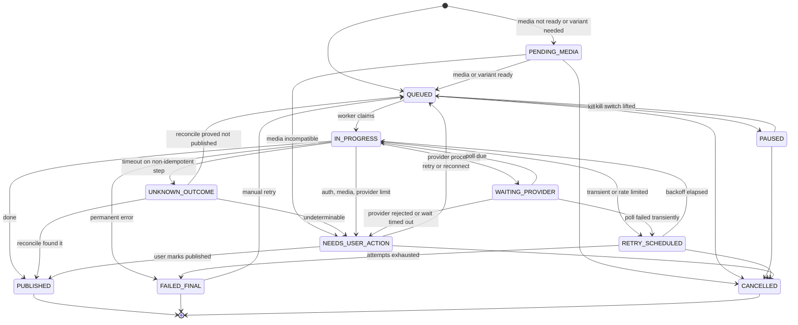
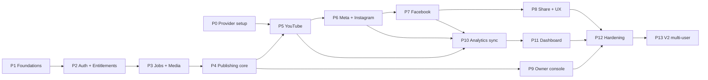

# Social Publishing App — Implementation Blueprint v2

**Target:** Android-first social publishing application
**Stack:** React Native + Expo (dev build), NestJS, PostgreSQL (Supabase), pg-boss, Cloudflare R2, ffmpeg
**Initial mode:** Single user (owner), multi-user ready
**Publishing targets (V1):** YouTube, Instagram, Facebook
**Disabled by default:** Music, Scheduling, AI captions, Auto hashtags, Multi-account

> **Provider facts in this document are marked _(verify)_ where they change often.** Meta and Google change API versions, metrics, limits and quotas regularly. Check the current official documentation before implementing each adapter (see §33).

---

## Table of Contents

0. [What Changed from v1](#0-what-changed-from-v1)
1. [Product Goal and V1 Scope](#1-product-goal-and-v1-scope)
2. [Non-Negotiable Rules](#2-non-negotiable-rules)
3. [Architecture Overview](#3-architecture-overview)
4. [Architecture Decision Records](#4-architecture-decision-records)
5. [Technology Stack](#5-technology-stack)
6. [Repository Structure](#6-repository-structure)
7. [Deployment Topology](#7-deployment-topology)
8. [Domain Model](#8-domain-model)
9. [Database Schema (Prisma)](#9-database-schema-prisma)
10. [Entitlement Engine](#10-entitlement-engine)
11. [Capabilities API](#11-capabilities-api)
12. [App Authentication](#12-app-authentication)
13. [Provider Connections (OAuth)](#13-provider-connections-oauth)
14. [Token Security](#14-token-security)
15. [Media Pipeline](#15-media-pipeline)
16. [Posts and Publications](#16-posts-and-publications)
17. [Job System](#17-job-system)
18. [Publishing State Machine and Checkpoints](#18-publishing-state-machine-and-checkpoints)
19. [Adapter Contracts](#19-adapter-contracts)
20. [YouTube Adapter](#20-youtube-adapter)
21. [Instagram Adapter](#21-instagram-adapter)
22. [Facebook Adapter](#22-facebook-adapter)
23. [Analytics](#23-analytics)
24. [Notifications](#24-notifications)
25. [Android App](#25-android-app)
26. [Owner Console and Admin](#26-owner-console-and-admin)
27. [Kill Switches and Audit](#27-kill-switches-and-audit)
28. [REST API Reference](#28-rest-api-reference)
29. [Configuration and Secrets](#29-configuration-and-secrets)
30. [Observability, Health, Backups](#30-observability-health-backups)
31. [Security Checklist](#31-security-checklist)
32. [Testing Strategy](#32-testing-strategy)
33. [Provider Verification Checklist](#33-provider-verification-checklist)
34. [Build Plan](#34-build-plan)
35. [Risk Register](#35-risk-register)
36. [Runbooks](#36-runbooks)
37. [Future Features and Upgrade Path](#37-future-features-and-upgrade-path)
38. [Definition of Done — V1](#38-definition-of-done--v1)

---

## 0. What Changed from v1

| # | Gap in v1 | Resolution in v2 | Section |
|---|---|---|---|
| 1 | Google OAuth app in "Testing" mode expires refresh tokens after 7 days | Consent screen must be **In production**; daily connection health job | §13, §34 Phase 0 |
| 2 | One Meta login can yield several Pages/IG accounts; v1 tied tokens to one social account | Split into `provider_connections` (grant) and `social_accounts` (destination) | §8, §9, §13 |
| 3 | Worker crash or timeout after a non-idempotent provider call causes **duplicate posts** | Checkpointed step adapters, `inFlight` marker, `UNKNOWN_OUTCOME` status, `reconcile()` | §18, §19 |
| 4 | Hand-rolled job queue, three separate schedulers | **pg-boss** for all jobs and crons, on the existing Postgres | §17 |
| 5 | Stuck job recovery missing | pg-boss expiry + publication optimistic locking + sweeper | §17 |
| 6 | Fixed metric columns break when providers rename/deprecate metrics (e.g. Instagram `impressions`) | Long-format metric points + `metric_definitions` catalog with `comparable_group` | §23 |
| 7 | Media validation needs ffprobe but ran synchronously in `POST /posts` | Async probe job on upload completion | §15 |
| 8 | Android HEVC 10-bit HDR / VFR videos get rejected or mangled | Normalized H.264 SDR variant, transcoded when needed | §15 |
| 9 | Single shared caption doesn't fit platform limits; no YouTube `madeForKids`/privacy | Per-destination overrides + server-described options schema | §11, §16 |
| 10 | No notification when publishing finishes | Expo push notifications | §24 |
| 11 | Kill switch not in schema; resolution order checked it last | `kill_switches` table, evaluated **first** | §10, §27 |
| 12 | Nullable `platform_id` in unique constraints allowed duplicates | `UNIQUE NULLS NOT DISTINCT` raw SQL migration | §9 |
| 13 | `user_platform_access` and `platforms.*_supported` duplicated other tables | Removed; `connect` is a feature; `platform_features` is the single source of truth | §9 |
| 14 | "Connected account valid" mixed into permissions | `can()` = allowed; connection state reported separately | §10, §11 |
| 15 | OAuth from mobile lacked `state`/PKCE/deep-link design | Server-stored state + PKCE + `openAuthSessionAsync` + deep link | §13 |
| 16 | Token encryption had no key rotation plan | AES-256-GCM, versioned keys, re-encryption job | §14 |
| 17 | Presigned PUT cannot enforce size on R2; flaky mobile uploads | Multipart upload with resume; HEAD verification on complete | §15 |
| 18 | R2 lifecycle "7 days after publishing" is not expressible as an R2 rule | App-level cleanup job + age-based R2 safety-net rule | §15 |
| 19 | SecureStore described as for non-sensitive data | SecureStore holds the refresh token | §12 |
| 20 | Three contradictory build orders (§43, §46, §53) | One phased plan with exit criteria, vertical slice first | §34 |
| 21 | Full Next.js admin before a single video is published | V1: owner console inside the app; Next.js admin in V2 | §26 |
| 22 | Supabase pooler, backups and storage limits not addressed | Pooler config, pg_dump-to-R2 backup job, raw-response retention | §7, §30 |
| 23 | YouTube quota, subscriber rounding, Shorts rules not addressed | Quota tracking table, analytics-based growth, Shorts validation | §20, §23 |
| 24 | Meta privacy policy URL / data deletion callback missing | Phase 0 prerequisite | §34 |
| 25 | Partial success had no post-level status | Post status rollup rules | §16 |

---

## 1. Product Goal and V1 Scope

### 1.1 Goal

From an Android phone, the owner can:

1. Share a video into the app (or pick one).
2. Enter a title and caption once, optionally customizing per platform.
3. Choose destinations the server says are available.
4. Upload the video **once**, resumably, to object storage.
5. Publish asynchronously to each destination with independent status and retries.
6. Get a push notification with the outcome.
7. Fix failures (retry, reconnect, confirm uncertain outcomes).
8. View combined and per-platform analytics and audience growth.
9. Change platforms, features and emergency switches remotely without shipping a new APK.

### 1.2 V1 Feature State

| Capability | V1 state |
|---|---|
| `youtube.publish`, `instagram.publish`, `facebook.publish` | ON |
| `youtube.analytics`, `instagram.analytics`, `facebook.analytics` | ON |
| `*.connect` | ON |
| `global.android_share` | ON |
| `global.admin` (owner console) | ON for OWNER |
| Remote platform/feature control, kill switches, audit | ON |
| Retry, cancel, resolve uncertain publications | ON |
| Push notifications | ON |
| Per-platform caption/options | ON |
| `*.schedule` | OFF |
| `*.music` | OFF |
| `global.ai_caption`, `global.auto_hashtag` | OFF |
| `*.multi_account` | OFF (one active destination per platform) |
| Next.js admin web, access-level editor UI, override editor UI | V2 |

### 1.3 Out of Scope for V1

- Editing or deleting already-published content on providers.
- Image/carousel posts (video only).
- Comment management / inbox.
- Public signup, billing, teams.
- iOS (the codebase stays cross-platform, but only Android is tested and shipped).

---

## 2. Non-Negotiable Rules

1. **Provider secrets never ship in the APK.** Mobile holds only its own app session.
2. **Mobile and admin never connect to PostgreSQL directly.** Everything goes through the API.
3. **Media goes directly from phone to R2.** The API only authorizes and records metadata.
4. **The backend enforces every capability.** Hidden UI is a convenience, not a control.
5. **Platforms, features and access are database-driven.** Never in env vars, never in client code.
6. **Kill switches win over everything**, including owner access and user overrides.
7. **Every platform is an adapter.** No provider-specific logic outside its adapter module.
8. **Publishing is asynchronous, durable and checkpointed.** Every provider-returned ID is persisted before the next step.
9. **A timeout on a non-idempotent provider call is `UNKNOWN_OUTCOME`, never an automatic retry.**
10. **A `PUBLISHED` publication is never published again.** Re-posting requires a new post.
11. **Every destination has its own status, attempts and error.**
12. **Analytics are stored as history, in long format, with a metric catalog.**
13. **Never sum or compare metrics across platforms unless their definitions share a `comparable_group`.** Derived metrics are labeled as derived.
14. **Every configuration change is audited** with actor, before/after and reason.
15. **OAuth tokens are encrypted at the application layer with versioned keys** and never logged.
16. **Provider API versions live in configuration**, not in business logic.
17. **Scheduling, when added, is server-side.** The phone doesn't need to be online.
18. **Music stays off until intentionally implemented and licensed.**
19. **Idempotency keys on post creation; unique `(post_id, social_account_id)` on publications.**
20. **Each phase ends with a working, deployed vertical slice**, not a pile of unconnected modules.

---

## 3. Architecture Overview



### 3.1 Backend internal layering



`InstagramPublisher` and `FacebookPublisher` share `MetaGraphClient`, `MetaTokenService` and `MetaErrorMapper`. They never call each other.

---

## 4. Architecture Decision Records

### ADR-1: pg-boss on Postgres instead of a hand-rolled queue or Redis
- **Context:** A single user, a need for durable jobs, retries, delayed polling and crons, and cheap infrastructure.
- **Decision:** Use pg-boss in the existing Supabase database (`pgboss` schema).
- **Consequences:** No Redis. `SKIP LOCKED`, expiry, retries, singleton keys and cron come built in. Migrating to BullMQ later only touches the `JobQueue` port.

### ADR-2: One Meta connection via Facebook Login for Business
- **Context:** Instagram publishing is available through Facebook Login (IG professional account linked to a Page) or through Instagram Login. Facebook Page publishing needs Facebook Login.
- **Decision:** Use Facebook Login for Business. One grant discovers Pages and their linked Instagram professional accounts.
- **Consequences:** The Instagram account must be Business/Creator **and linked to a Facebook Page** _(verify)_. An Instagram Login provider can be added later as another `ProviderKind` without schema changes to destinations.

### ADR-3: Long-format metrics with a catalog
- **Decision:** `account_metric_points` / `publication_metric_points` rows keyed by `metric_key`, defined in `metric_definitions`.
- **Consequences:** Provider metric renames become catalog updates, not migrations. Cross-platform totals only use metrics sharing a `comparable_group`.

### ADR-4: Checkpointed step adapters
- **Decision:** Adapters expose `runStep(step)` returning `advance | wait | done`. The runner persists checkpoints between steps and marks non-idempotent steps as in flight.
- **Consequences:** Crashes resume from the last confirmed step. Uncertain outcomes are reconciled instead of re-posted.

### ADR-5: Owner console inside the mobile app for V1
- **Decision:** Admin screens gated by `global.admin` live in the app. `/v1/admin/*` endpoints are designed for a future web admin.
- **Consequences:** One UI codebase in V1. The Next.js admin arrives in V2 against the same endpoints.

### ADR-6: One deployable image with process roles
- **Decision:** One Docker image (Node LTS + ffmpeg). `PROCESS_ROLE=api|worker|all`. V1 runs `all` in a single Railway service.
- **Consequences:** Low cost now. Splitting later is a config change.

### ADR-7: Capability keys are lowercase strings
- **Decision:** Format `{platform_code}.{feature_code}` or `global.{feature_code}`, e.g. `instagram.publish`, `global.android_share`. Feature codes are lowercase snake_case in the database, so no mapping layer exists.

### ADR-8: Transcode only when needed
- **Decision:** Probe every upload. If any selected destination's rules reject the original but a normalized variant would pass, create an H.264 SDR variant once and use it for those destinations.
- **Consequences:** Most uploads skip transcoding. Problem files still publish. Controlled by `app_settings.transcode_policy` (`when_needed | always | never`).

### ADR-9: Destinations are social accounts, not platform codes
- **Decision:** `POST /v1/posts` takes `destinations[].socialAccountId`. The server derives the platform.
- **Consequences:** Multi-account support later needs no API change.

---

## 5. Technology Stack

### 5.1 Android app

| Concern | Choice |
|---|---|
| Runtime | Expo SDK (latest stable), **EAS dev build** (share intent needs native config; Expo Go is not enough) |
| Language | TypeScript (strict) |
| Navigation | Expo Router |
| Server state | TanStack Query |
| Local state | Zustand, persisted with MMKV (drafts, upload progress) |
| Forms | React Hook Form + Zod (schemas from `packages/contracts`) |
| Secure storage | `expo-secure-store` (refresh token) |
| Share target | `expo-share-intent` config plugin |
| OAuth browser | `expo-web-browser` `openAuthSessionAsync` |
| Media pick/preview | `expo-image-picker` (system photo picker), `expo-video` |
| File I/O | `expo-file-system` (copy `content://` URIs, read byte ranges for multipart) _(verify API on target SDK)_ |
| Keep awake during upload | `expo-keep-awake` |
| Push | `expo-notifications` (FCM credentials configured in EAS) |
| Charts | `victory-native` or `react-native-gifted-charts` |
| Errors | `@sentry/react-native` |
| E2E | Maestro |

### 5.2 Backend

| Concern | Choice |
|---|---|
| Runtime | Node.js LTS, NestJS, TypeScript (strict) |
| ORM | Prisma |
| Validation | Zod via `nestjs-zod`, shared schemas in `packages/contracts` |
| Jobs / cron | pg-boss |
| Object storage | `@aws-sdk/client-s3` + `@aws-sdk/s3-request-presigner` against R2 |
| Media | `ffmpeg` + `ffprobe` installed in the Docker image |
| Google | `googleapis` (or thin fetch client for resumable upload) |
| Meta | Internal `MetaGraphClient` (fetch-based, versioned base URL) |
| Password hashing | `argon2` (argon2id) |
| Logging | `nestjs-pino` with redaction |
| Errors | `@sentry/nestjs` |
| Push | `expo-server-sdk` |
| Rate limiting | `@nestjs/throttler` |
| HTTP hardening | `helmet` |
| Tests | Vitest/Jest, Testcontainers (Postgres), MinIO (S3-compatible), `msw`/`nock` fixtures |

### 5.3 Infrastructure

| Concern | Choice |
|---|---|
| API + worker | Railway (single service in V1) |
| Database | Supabase PostgreSQL (Postgres 15+ required for `NULLS NOT DISTINCT`) |
| Media + backups | Cloudflare R2 (separate buckets: `media`, `backups`) |
| DNS / TLS | Cloudflare |
| Mobile builds | EAS Build (internal distribution APK) |
| Admin web (V2) | Cloudflare Pages or Vercel |
| Monitoring | Sentry (API, worker, mobile) |

### 5.4 Monorepo tooling

- pnpm workspaces + Turborepo
- Shared ESLint/Prettier/TS configs
- GitHub Actions: lint, typecheck, unit tests, Prisma migration check, Docker build

---

## 6. Repository Structure

```text
social-publisher/
├── apps/
│   ├── mobile/
│   │   ├── app/                         # Expo Router routes
│   │   │   ├── (auth)/login.tsx
│   │   │   ├── (app)/index.tsx          # Home
│   │   │   ├── (app)/create.tsx         # Create Post (also share target)
│   │   │   ├── (app)/posts/index.tsx
│   │   │   ├── (app)/posts/[id].tsx
│   │   │   ├── (app)/connections/index.tsx
│   │   │   ├── (app)/connections/[id]/destinations.tsx
│   │   │   ├── (app)/analytics/index.tsx
│   │   │   ├── (app)/analytics/[accountId].tsx
│   │   │   ├── (app)/analytics/posts/[id].tsx
│   │   │   └── (app)/settings/...       # Owner console (global.admin)
│   │   ├── features/                    # capabilities, upload, posts, analytics, console
│   │   ├── components/
│   │   ├── services/api/                # typed client from contracts
│   │   ├── stores/                      # zustand (session, drafts, uploads)
│   │   └── app.config.ts
│   │
│   ├── api/
│   │   ├── Dockerfile                   # node LTS + ffmpeg + postgresql-client
│   │   └── src/
│   │       ├── main.ts                  # reads PROCESS_ROLE
│   │       ├── bootstrap/{api,worker}.ts
│   │       ├── common/                  # errors, request context, pagination
│   │       ├── config/                  # typed env loader
│   │       ├── crypto/                  # TokenCipher, key rotation
│   │       ├── auth/
│   │       ├── users/
│   │       ├── entitlements/            # EntitlementService, CapabilityGuard, explain()
│   │       ├── catalog/                 # platforms, features, platform-features
│   │       ├── kill-switches/
│   │       ├── settings/                # app_settings
│   │       ├── audit/
│   │       ├── connections/             # OAuth start/callback, health
│   │       ├── social-accounts/
│   │       ├── providers/
│   │       │   ├── google/              # GoogleClient, GoogleAuthProvider
│   │       │   └── meta/                # MetaGraphClient, MetaAuthProvider, MetaErrorMapper
│   │       ├── media/                   # uploads, storage service
│   │       ├── media-processing/        # probe, transcode, rules validator
│   │       ├── posts/
│   │       ├── publishing/              # PublicationRunner, state machine, reconcile
│   │       ├── publishers/
│   │       │   ├── youtube/
│   │       │   ├── instagram/
│   │       │   ├── facebook/
│   │       │   └── fake/
│   │       ├── analytics/               # sync jobs, catalog, query service
│   │       ├── analytics-providers/{youtube,instagram,facebook}/
│   │       ├── jobs/                    # JobQueue port, pg-boss adapter, cron registry
│   │       ├── notifications/
│   │       ├── admin/                   # /v1/admin controllers
│   │       └── health/
│   │
│   └── admin/                           # V2: Next.js
│
├── packages/
│   ├── contracts/                       # Zod schemas, DTO types, capability keys, error codes
│   ├── tsconfig/
│   └── eslint-config/
│
├── prisma/
│   ├── schema.prisma
│   ├── migrations/
│   └── seed.ts
│
├── scripts/
│   ├── create-owner.ts                  # CLI: create the owner account
│   └── rotate-token-key.ts
│
└── docs/
    ├── adr/
    ├── runbooks/
    └── provider-notes/                  # verified limits per API version, with dates
```

---

## 7. Deployment Topology



### 7.1 Database connections _(verify against current Supabase docs)_

| Client | Connection | Why |
|---|---|---|
| Prisma queries | Supabase **transaction pooler** with `?pgbouncer=true&connection_limit=5` | Many short queries, low connection use |
| Prisma migrations | `DIRECT_DATABASE_URL` (direct or session pooler) | Migrations need session features |
| pg-boss | **Session pooler or direct** connection | pg-boss relies on session-level behavior |

### 7.2 Process roles

```ts
// apps/api/src/main.ts
const role = env.PROCESS_ROLE; // 'api' | 'worker' | 'all'
if (role === 'api' || role === 'all') await bootstrapApi();
if (role === 'worker' || role === 'all') await bootstrapWorker();
```

Graceful shutdown: on `SIGTERM`, stop accepting HTTP, call `boss.stop({ graceful: true })`, and let in-flight steps finish or reach a checkpoint (worker shutdown timeout ≥ 60 s).

### 7.3 R2 buckets and keys

```text
media bucket
  media/{userId}/{mediaId}/original.{ext}
  media/{userId}/{mediaId}/variants/{kind}.mp4
  media/{userId}/{mediaId}/thumb.jpg

backups bucket (separate API token, write-only from the service where possible)
  pg/{yyyy}/{mm}/{dd}/app.dump
```

R2 lifecycle rules (safety net; the app deletes earlier):

- `media/` → delete objects older than **30 days**.
- Abort incomplete multipart uploads after **1 day**.
- `pg/` → delete older than **30 days**.

R2 CORS is **not** needed for the native app. Add it only when the V2 web admin uploads directly.

---

## 8. Domain Model



### 8.1 Concepts

| Concept | Meaning | Example |
|---|---|---|
| **Platform** | A publishing destination type with an adapter | `youtube`, `instagram`, `facebook` |
| **Feature** | A capability dimension | `publish`, `analytics`, `connect`, `android_share` |
| **Capability** | Platform × feature (or global feature), resolved per user | `instagram.publish` |
| **Provider connection** | One OAuth grant with a provider; holds user-level tokens | "Meta login of the owner" |
| **Social account** | One destination discovered through a connection | "Page: My Brand", "IG: @mybrand", "Channel: My Channel" |
| **Media** | One uploaded original file plus probe results | `IMG_2044.mp4` |
| **Media variant** | A derived file (normalized H.264 SDR) | `variants/h264_sdr.mp4` |
| **Post** | One logical publishing intent: media + shared text | "Sunset reel" |
| **Publication** | The post delivered to one social account | "Sunset reel → YouTube" |
| **Publication attempt** | One step execution, kept for history and debugging | Attempt 2, failed at `UPLOAD_BYTES`, HTTP 503 |
| **Metric definition** | Catalog entry describing a provider or derived metric | `youtube.account.subscribers_gained` |
| **Kill switch** | Emergency deny for a platform, a feature, or a platform-feature pair | `instagram` × `publish` |

### 8.2 Provider to platform mapping

| Provider (`ProviderKind`) | Connection yields | Platforms |
|---|---|---|
| `GOOGLE` | YouTube channel(s) of the Google account | `youtube` |
| `META` | Facebook Pages (with Page tokens) and their linked Instagram professional accounts | `facebook`, `instagram` |

Disconnecting is a **soft delete**: tokens are wiped, the connection and its social accounts become `DISCONNECTED`, and publication history stays.

---

## 9. Database Schema (Prisma)

### 9.1 `prisma/schema.prisma`

```prisma
generator client {
  provider = "prisma-client-js"
}

datasource db {
  provider  = "postgresql"
  url       = env("DATABASE_URL")
  directUrl = env("DIRECT_DATABASE_URL")
}

// ─────────────────────────── Enums ───────────────────────────

enum UserStatus {
  ACTIVE
  SUSPENDED
  DELETED
}

enum FeatureScope {
  GLOBAL
  PLATFORM
}

enum OverrideEffect {
  ALLOW
  DENY
}

enum ProviderKind {
  GOOGLE
  META
}

enum ConnectionStatus {
  CONNECTED
  REFRESH_FAILING
  REAUTH_REQUIRED
  DISCONNECTED
}

enum SocialAccountStatus {
  ACTIVE
  INACTIVE
  NOT_ELIGIBLE
  REAUTH_REQUIRED
  DISCONNECTED
}

enum MediaStatus {
  PENDING_UPLOAD
  UPLOADED
  PROBING
  READY
  INVALID
  DELETED
}

enum MediaVariantKind {
  H264_SDR
}

enum VariantStatus {
  PROCESSING
  READY
  FAILED
}

enum PostStatus {
  SCHEDULED
  PUBLISHING
  PUBLISHED
  PARTIALLY_PUBLISHED
  NEEDS_ATTENTION
  FAILED
  CANCELLED
}

enum PublicationStatus {
  PENDING_MEDIA
  QUEUED
  IN_PROGRESS
  WAITING_PROVIDER
  RETRY_SCHEDULED
  UNKNOWN_OUTCOME
  NEEDS_USER_ACTION
  PAUSED
  PUBLISHED
  FAILED_FINAL
  CANCELLED
}

enum ErrorCategory {
  TRANSIENT
  RATE_LIMITED
  PROVIDER_LIMIT
  UNKNOWN_OUTCOME
  AUTH
  MEDIA_INVALID
  PERMISSION
  VALIDATION
  INTERNAL
}

enum AttemptOutcome {
  ADVANCED
  WAITING
  SUCCEEDED
  FAILED
  ABANDONED
}

enum MetricEntity {
  ACCOUNT
  PUBLICATION
}

enum MetricGranularity {
  SNAPSHOT
  DAILY
}

enum MetricAggregation {
  SUM
  LATEST
  AVERAGE
}

// ─────────────────────── Identity & Access ───────────────────────

model AccessLevel {
  id        String   @id @default(uuid()) @db.Uuid
  code      String   @unique
  name      String
  priority  Int      @default(0)
  enabled   Boolean  @default(true)
  createdAt DateTime @default(now()) @map("created_at")
  updatedAt DateTime @updatedAt @map("updated_at")

  users        User[]
  capabilities AccessLevelCapability[]

  @@map("access_levels")
}

model User {
  id            String     @id @default(uuid()) @db.Uuid
  email         String     @unique
  passwordHash  String     @map("password_hash")
  displayName   String?    @map("display_name")
  accessLevelId String     @map("access_level_id") @db.Uuid
  status        UserStatus @default(ACTIVE)
  createdAt     DateTime   @default(now()) @map("created_at")
  updatedAt     DateTime   @updatedAt @map("updated_at")

  accessLevel      AccessLevel              @relation(fields: [accessLevelId], references: [id])
  sessions         RefreshSession[]
  devices          Device[]
  overrides        UserCapabilityOverride[] @relation("OverrideSubject")
  overridesCreated UserCapabilityOverride[] @relation("OverrideCreator")
  killSwitches     KillSwitch[]
  oauthStates      OAuthState[]
  connections      ProviderConnection[]
  socialAccounts   SocialAccount[]
  media            Media[]
  posts            Post[]
  auditLogs        AuditLog[]

  @@map("users")
}

model RefreshSession {
  id         String    @id @default(uuid()) @db.Uuid
  userId     String    @map("user_id") @db.Uuid
  familyId   String    @map("family_id") @db.Uuid
  tokenHash  String    @unique @map("token_hash")
  deviceName String?   @map("device_name")
  expiresAt  DateTime  @map("expires_at")
  usedAt     DateTime? @map("used_at")
  revokedAt  DateTime? @map("revoked_at")
  createdAt  DateTime  @default(now()) @map("created_at")

  user User @relation(fields: [userId], references: [id], onDelete: Cascade)

  @@index([familyId])
  @@map("refresh_sessions")
}

model Device {
  id            String   @id @default(uuid()) @db.Uuid
  userId        String   @map("user_id") @db.Uuid
  expoPushToken String   @unique @map("expo_push_token")
  platform      String   @default("android")
  appVersion    String?  @map("app_version")
  lastSeenAt    DateTime @default(now()) @map("last_seen_at")
  createdAt     DateTime @default(now()) @map("created_at")

  user User @relation(fields: [userId], references: [id], onDelete: Cascade)

  @@map("devices")
}

// ───────────────────── Catalog & Entitlements ─────────────────────

model Platform {
  id        String       @id @default(uuid()) @db.Uuid
  code      String       @unique
  name      String
  provider  ProviderKind
  enabled   Boolean      @default(false)
  sortOrder Int          @default(0) @map("sort_order")
  /// display metadata, apiVersion override, publish limits, option schemas
  config    Json         @default("{}")
  createdAt DateTime     @default(now()) @map("created_at")
  updatedAt DateTime     @updatedAt @map("updated_at")

  features           PlatformFeature[]
  accessCapabilities AccessLevelCapability[]
  overrides          UserCapabilityOverride[]
  killSwitches       KillSwitch[]
  socialAccounts     SocialAccount[]
  publications       Publication[]
  metricDefinitions  MetricDefinition[]

  @@map("platforms")
}

model Feature {
  id          String       @id @default(uuid()) @db.Uuid
  code        String       @unique
  name        String
  description String?
  scope       FeatureScope
  enabled     Boolean      @default(false)
  createdAt   DateTime     @default(now()) @map("created_at")
  updatedAt   DateTime     @updatedAt @map("updated_at")

  platforms          PlatformFeature[]
  accessCapabilities AccessLevelCapability[]
  overrides          UserCapabilityOverride[]
  killSwitches       KillSwitch[]

  @@map("features")
}

model PlatformFeature {
  id         String   @id @default(uuid()) @db.Uuid
  platformId String   @map("platform_id") @db.Uuid
  featureId  String   @map("feature_id") @db.Uuid
  enabled    Boolean  @default(false)
  config     Json     @default("{}")
  updatedAt  DateTime @updatedAt @map("updated_at")

  platform Platform @relation(fields: [platformId], references: [id], onDelete: Cascade)
  feature  Feature  @relation(fields: [featureId], references: [id], onDelete: Cascade)

  @@unique([platformId, featureId])
  @@map("platform_features")
}

model AccessLevelCapability {
  id            String  @id @default(uuid()) @db.Uuid
  accessLevelId String  @map("access_level_id") @db.Uuid
  /// null = applies to every platform for this feature
  platformId    String? @map("platform_id") @db.Uuid
  featureId     String  @map("feature_id") @db.Uuid
  allowed       Boolean

  accessLevel AccessLevel @relation(fields: [accessLevelId], references: [id], onDelete: Cascade)
  platform    Platform?   @relation(fields: [platformId], references: [id], onDelete: Cascade)
  feature     Feature     @relation(fields: [featureId], references: [id], onDelete: Cascade)

  // uniqueness in raw SQL: UNIQUE NULLS NOT DISTINCT (access_level_id, platform_id, feature_id)
  @@index([accessLevelId])
  @@map("access_level_capabilities")
}

model UserCapabilityOverride {
  id          String         @id @default(uuid()) @db.Uuid
  userId      String         @map("user_id") @db.Uuid
  platformId  String?        @map("platform_id") @db.Uuid
  featureId   String         @map("feature_id") @db.Uuid
  effect      OverrideEffect
  reason      String
  expiresAt   DateTime?      @map("expires_at")
  createdById String?        @map("created_by_id") @db.Uuid
  createdAt   DateTime       @default(now()) @map("created_at")

  user      User      @relation("OverrideSubject", fields: [userId], references: [id], onDelete: Cascade)
  createdBy User?     @relation("OverrideCreator", fields: [createdById], references: [id], onDelete: SetNull)
  platform  Platform? @relation(fields: [platformId], references: [id], onDelete: Cascade)
  feature   Feature   @relation(fields: [featureId], references: [id], onDelete: Cascade)

  // uniqueness in raw SQL: UNIQUE NULLS NOT DISTINCT (user_id, platform_id, feature_id)
  @@index([userId])
  @@map("user_capability_overrides")
}

model KillSwitch {
  id              String    @id @default(uuid()) @db.Uuid
  /// platform only = whole platform; feature only = feature everywhere; both = that pair
  platformId      String?   @map("platform_id") @db.Uuid
  featureId       String?   @map("feature_id") @db.Uuid
  active          Boolean   @default(true)
  pauseQueuedJobs Boolean   @default(true) @map("pause_queued_jobs")
  reason          String
  activatedById   String?   @map("activated_by_id") @db.Uuid
  activatedAt     DateTime  @default(now()) @map("activated_at")
  deactivatedAt   DateTime? @map("deactivated_at")

  platform    Platform? @relation(fields: [platformId], references: [id], onDelete: Cascade)
  feature     Feature?  @relation(fields: [featureId], references: [id], onDelete: Cascade)
  activatedBy User?     @relation(fields: [activatedById], references: [id], onDelete: SetNull)

  // CHECK (platform_id IS NOT NULL OR feature_id IS NOT NULL) in raw SQL
  @@index([active])
  @@map("kill_switches")
}

model AppSetting {
  key       String   @id
  value     Json
  updatedAt DateTime @updatedAt @map("updated_at")

  @@map("app_settings")
}

// ───────────────────── Connections & Destinations ─────────────────────

model OAuthState {
  id            String       @id @default(uuid()) @db.Uuid
  state         String       @unique
  userId        String       @map("user_id") @db.Uuid
  provider      ProviderKind
  codeVerifier  String?      @map("code_verifier")
  platformCodes String[]     @map("platform_codes")
  expiresAt     DateTime     @map("expires_at")
  consumedAt    DateTime?    @map("consumed_at")
  createdAt     DateTime     @default(now()) @map("created_at")

  user User @relation(fields: [userId], references: [id], onDelete: Cascade)

  @@map("oauth_states")
}

model ProviderConnection {
  id                   String           @id @default(uuid()) @db.Uuid
  userId               String           @map("user_id") @db.Uuid
  provider             ProviderKind
  externalUserId       String           @map("external_user_id")
  externalUserName     String?          @map("external_user_name")
  scopes               String[]
  accessTokenEnc       Bytes?           @map("access_token_enc")
  refreshTokenEnc      Bytes?           @map("refresh_token_enc")
  tokenKeyVersion      Int?             @map("token_key_version")
  accessTokenExpiresAt DateTime?        @map("access_token_expires_at")
  status               ConnectionStatus @default(CONNECTED)
  lastRefreshedAt      DateTime?        @map("last_refreshed_at")
  lastValidatedAt      DateTime?        @map("last_validated_at")
  lastError            String?          @map("last_error")
  metadata             Json             @default("{}")
  createdAt            DateTime         @default(now()) @map("created_at")
  updatedAt            DateTime         @updatedAt @map("updated_at")

  user           User            @relation(fields: [userId], references: [id], onDelete: Cascade)
  socialAccounts SocialAccount[]

  @@unique([userId, provider, externalUserId])
  @@map("provider_connections")
}

model SocialAccount {
  id                  String              @id @default(uuid()) @db.Uuid
  userId              String              @map("user_id") @db.Uuid
  platformId          String              @map("platform_id") @db.Uuid
  connectionId        String              @map("connection_id") @db.Uuid
  externalAccountId   String              @map("external_account_id")
  displayName         String              @map("display_name")
  handle              String?
  avatarUrl           String?             @map("avatar_url")
  /// e.g. Facebook Page access token; null when the connection token is used
  destinationTokenEnc Bytes?              @map("destination_token_enc")
  tokenKeyVersion     Int?                @map("token_key_version")
  status              SocialAccountStatus @default(INACTIVE)
  statusReason        String?             @map("status_reason")
  metadata            Json                @default("{}")
  connectedAt         DateTime            @default(now()) @map("connected_at")
  lastMetricsSyncedAt DateTime?           @map("last_metrics_synced_at")
  updatedAt           DateTime            @updatedAt @map("updated_at")

  user         User                  @relation(fields: [userId], references: [id], onDelete: Cascade)
  platform     Platform              @relation(fields: [platformId], references: [id])
  connection   ProviderConnection    @relation(fields: [connectionId], references: [id])
  publications Publication[]
  metricPoints AccountMetricPoint[]
  rawResponses ProviderRawResponse[]

  @@unique([userId, platformId, externalAccountId])
  @@map("social_accounts")
}

// ───────────────────────────── Media ─────────────────────────────

model Media {
  id                  String      @id @default(uuid()) @db.Uuid
  userId              String      @map("user_id") @db.Uuid
  storageKey          String      @unique @map("storage_key")
  multipartUploadId   String?     @map("multipart_upload_id")
  originalFilename    String?     @map("original_filename")
  declaredMimeType    String      @map("declared_mime_type")
  declaredSizeBytes   BigInt      @map("declared_size_bytes")
  sizeBytes           BigInt?     @map("size_bytes")
  status              MediaStatus @default(PENDING_UPLOAD)
  invalidReason       String?     @map("invalid_reason")
  container           String?
  videoCodec          String?     @map("video_codec")
  audioCodec          String?     @map("audio_codec")
  width               Int?
  height              Int?
  rotation            Int?
  durationMs          Int?        @map("duration_ms")
  frameRate           Float?      @map("frame_rate")
  isVariableFrameRate Boolean?    @map("is_variable_frame_rate")
  isHdr               Boolean?    @map("is_hdr")
  bitDepth            Int?        @map("bit_depth")
  hasAudio            Boolean?    @map("has_audio")
  probe               Json?
  createdAt           DateTime    @default(now()) @map("created_at")
  uploadedAt          DateTime?   @map("uploaded_at")
  deleteAfter         DateTime?   @map("delete_after")
  deletedAt           DateTime?   @map("deleted_at")

  user     User           @relation(fields: [userId], references: [id], onDelete: Cascade)
  variants MediaVariant[]
  posts    Post[]

  @@index([status, deleteAfter])
  @@map("media")
}

model MediaVariant {
  id         String           @id @default(uuid()) @db.Uuid
  mediaId    String           @map("media_id") @db.Uuid
  kind       MediaVariantKind
  storageKey String           @unique @map("storage_key")
  status     VariantStatus    @default(PROCESSING)
  sizeBytes  BigInt?          @map("size_bytes")
  probe      Json?
  error      String?
  createdAt  DateTime         @default(now()) @map("created_at")
  readyAt    DateTime?        @map("ready_at")

  media        Media         @relation(fields: [mediaId], references: [id], onDelete: Cascade)
  publications Publication[]

  @@unique([mediaId, kind])
  @@map("media_variants")
}

// ─────────────────────── Posts & Publishing ───────────────────────

model Post {
  id             String     @id @default(uuid()) @db.Uuid
  userId         String     @map("user_id") @db.Uuid
  mediaId        String     @map("media_id") @db.Uuid
  title          String?
  caption        String?
  status         PostStatus @default(PUBLISHING)
  scheduledAt    DateTime?  @map("scheduled_at")
  idempotencyKey String     @map("idempotency_key")
  requestHash    String     @map("request_hash")
  notifiedAt     DateTime?  @map("notified_at")
  createdAt      DateTime   @default(now()) @map("created_at")
  updatedAt      DateTime   @updatedAt @map("updated_at")

  user         User          @relation(fields: [userId], references: [id], onDelete: Cascade)
  media        Media         @relation(fields: [mediaId], references: [id])
  publications Publication[]

  @@unique([userId, idempotencyKey])
  @@index([userId, createdAt])
  @@map("posts")
}

model Publication {
  id                  String            @id @default(uuid()) @db.Uuid
  postId              String            @map("post_id") @db.Uuid
  socialAccountId     String            @map("social_account_id") @db.Uuid
  platformId          String            @map("platform_id") @db.Uuid
  mediaVariantId      String?           @map("media_variant_id") @db.Uuid
  status              PublicationStatus @default(QUEUED)
  titleOverride       String?           @map("title_override")
  captionOverride     String?           @map("caption_override")
  options             Json              @default("{}")
  currentStep         String?           @map("current_step")
  /// provider IDs, upload session URIs, byte offsets, inFlight marker
  checkpoint          Json              @default("{}")
  attemptCount        Int               @default(0) @map("attempt_count")
  nextAttemptAt       DateTime?         @map("next_attempt_at")
  waitingSince        DateTime?         @map("waiting_since")
  externalId          String?           @map("external_id")
  externalUrl         String?           @map("external_url")
  errorCategory       ErrorCategory?    @map("error_category")
  errorCode           String?           @map("error_code")
  providerErrorCode   String?           @map("provider_error_code")
  errorMessage        String?           @map("error_message")
  resolvedManually    Boolean           @default(false) @map("resolved_manually")
  queuedAt            DateTime          @default(now()) @map("queued_at")
  startedAt           DateTime?         @map("started_at")
  publishedAt         DateTime?         @map("published_at")
  lastCheckedAt       DateTime?         @map("last_checked_at")
  lastMetricsSyncedAt DateTime?         @map("last_metrics_synced_at")
  version             Int               @default(0)
  createdAt           DateTime          @default(now()) @map("created_at")
  updatedAt           DateTime          @updatedAt @map("updated_at")

  post          Post                     @relation(fields: [postId], references: [id], onDelete: Cascade)
  socialAccount SocialAccount            @relation(fields: [socialAccountId], references: [id])
  platform      Platform                 @relation(fields: [platformId], references: [id])
  mediaVariant  MediaVariant?            @relation(fields: [mediaVariantId], references: [id])
  attempts      PublicationAttempt[]
  metricPoints  PublicationMetricPoint[]
  rawResponses  ProviderRawResponse[]

  @@unique([postId, socialAccountId])
  @@index([status, nextAttemptAt])
  @@index([socialAccountId, publishedAt])
  @@map("publications")
}

model PublicationAttempt {
  id                String          @id @default(uuid()) @db.Uuid
  publicationId     String          @map("publication_id") @db.Uuid
  attemptNumber     Int             @map("attempt_number")
  jobId             String?         @map("job_id")
  step              String
  outcome           AttemptOutcome?
  errorCategory     ErrorCategory?  @map("error_category")
  httpStatus        Int?            @map("http_status")
  providerErrorCode String?         @map("provider_error_code")
  errorMessage      String?         @map("error_message")
  startedAt         DateTime        @default(now()) @map("started_at")
  finishedAt        DateTime?       @map("finished_at")

  publication Publication @relation(fields: [publicationId], references: [id], onDelete: Cascade)

  @@index([publicationId, startedAt])
  @@map("publication_attempts")
}

// ─────────────────────────── Analytics ───────────────────────────

model MetricDefinition {
  /// e.g. "youtube.account.subscribers_gained"
  key             String            @id
  /// null for derived cross-platform metrics
  platformId      String?           @map("platform_id") @db.Uuid
  entity          MetricEntity
  granularity     MetricGranularity
  displayName     String            @map("display_name")
  description     String?
  unit            String            @default("count")
  aggregation     MetricAggregation
  providerMetric  String?           @map("provider_metric")
  comparableGroup String?           @map("comparable_group")
  isDerived       Boolean           @default(false) @map("is_derived")
  enabled         Boolean           @default(true)
  deprecatedAt    DateTime?         @map("deprecated_at")

  platform          Platform?                @relation(fields: [platformId], references: [id])
  accountPoints     AccountMetricPoint[]
  publicationPoints PublicationMetricPoint[]

  @@map("metric_definitions")
}

model AccountMetricPoint {
  id              BigInt   @id @default(autoincrement())
  socialAccountId String   @map("social_account_id") @db.Uuid
  metricKey       String   @map("metric_key")
  /// DAILY: "2026-09-14" (provider reporting date); SNAPSHOT: "2026-09-14T15" (UTC hour)
  bucketKey       String   @map("bucket_key")
  bucketStart     DateTime @map("bucket_start")
  value           Decimal  @db.Decimal(20, 4)
  capturedAt      DateTime @default(now()) @map("captured_at")

  socialAccount SocialAccount    @relation(fields: [socialAccountId], references: [id], onDelete: Cascade)
  metric        MetricDefinition @relation(fields: [metricKey], references: [key])

  @@unique([socialAccountId, metricKey, bucketKey])
  @@index([socialAccountId, metricKey, bucketStart])
  @@map("account_metric_points")
}

model PublicationMetricPoint {
  id            BigInt   @id @default(autoincrement())
  publicationId String   @map("publication_id") @db.Uuid
  metricKey     String   @map("metric_key")
  bucketKey     String   @map("bucket_key")
  bucketStart   DateTime @map("bucket_start")
  value         Decimal  @db.Decimal(20, 4)
  capturedAt    DateTime @default(now()) @map("captured_at")

  publication Publication      @relation(fields: [publicationId], references: [id], onDelete: Cascade)
  metric      MetricDefinition @relation(fields: [metricKey], references: [key])

  @@unique([publicationId, metricKey, bucketKey])
  @@index([publicationId, metricKey, bucketStart])
  @@map("publication_metric_points")
}

model ProviderRawResponse {
  id              BigInt   @id @default(autoincrement())
  socialAccountId String?  @map("social_account_id") @db.Uuid
  publicationId   String?  @map("publication_id") @db.Uuid
  kind            String
  payload         Json
  capturedAt      DateTime @default(now()) @map("captured_at")

  socialAccount SocialAccount? @relation(fields: [socialAccountId], references: [id], onDelete: Cascade)
  publication   Publication?   @relation(fields: [publicationId], references: [id], onDelete: Cascade)

  @@index([capturedAt])
  @@map("provider_raw_responses")
}

model ProviderQuotaUsage {
  id         String       @id @default(uuid()) @db.Uuid
  provider   ProviderKind
  quotaName  String       @map("quota_name")
  /// quota day in the provider's reset timezone
  day        DateTime     @db.Date
  unitsUsed  Int          @default(0) @map("units_used")
  unitsLimit Int?         @map("units_limit")
  updatedAt  DateTime     @updatedAt @map("updated_at")

  @@unique([provider, quotaName, day])
  @@map("provider_quota_usage")
}

model SyncRun {
  id              String    @id @default(uuid()) @db.Uuid
  kind            String
  socialAccountId String?   @map("social_account_id") @db.Uuid
  status          String
  itemsProcessed  Int       @default(0) @map("items_processed")
  error           String?
  startedAt       DateTime  @default(now()) @map("started_at")
  finishedAt      DateTime? @map("finished_at")

  @@index([kind, startedAt])
  @@map("sync_runs")
}

// ───────────────────────────── Audit ─────────────────────────────

model AuditLog {
  id          BigInt   @id @default(autoincrement())
  actorUserId String?  @map("actor_user_id") @db.Uuid
  action      String
  entityType  String   @map("entity_type")
  entityId    String?  @map("entity_id")
  oldValue    Json?    @map("old_value")
  newValue    Json?    @map("new_value")
  reason      String?
  ipAddress   String?  @map("ip_address")
  requestId   String?  @map("request_id")
  createdAt   DateTime @default(now()) @map("created_at")

  actor User? @relation(fields: [actorUserId], references: [id], onDelete: SetNull)

  @@index([entityType, entityId])
  @@index([createdAt])
  @@map("audit_logs")
}
```

### 9.2 Raw SQL migration (add after the first Prisma migration)

Prisma can't express these, so add them in a migration created with `prisma migrate dev --create-only`:

```sql
-- Nullable platform_id must still be unique (Postgres 15+)
ALTER TABLE access_level_capabilities
  ADD CONSTRAINT access_level_capabilities_uniq
  UNIQUE NULLS NOT DISTINCT (access_level_id, platform_id, feature_id);

ALTER TABLE user_capability_overrides
  ADD CONSTRAINT user_capability_overrides_uniq
  UNIQUE NULLS NOT DISTINCT (user_id, platform_id, feature_id);

-- A kill switch must target something
ALTER TABLE kill_switches
  ADD CONSTRAINT kill_switches_scope_chk
  CHECK (platform_id IS NOT NULL OR feature_id IS NOT NULL);

-- Only one active kill switch per scope
CREATE UNIQUE INDEX kill_switches_one_active_per_scope
  ON kill_switches (
    COALESCE(platform_id, '00000000-0000-0000-0000-000000000000'::uuid),
    COALESCE(feature_id,  '00000000-0000-0000-0000-000000000000'::uuid)
  )
  WHERE active;

-- At most one ACTIVE destination per user+platform while multi_account is off
-- (drop this index when multi_account ships)
CREATE UNIQUE INDEX social_accounts_one_active_per_platform
  ON social_accounts (user_id, platform_id)
  WHERE status = 'ACTIVE';

-- A publication that is PUBLISHED must have an external id unless resolved manually
ALTER TABLE publications
  ADD CONSTRAINT publications_published_has_ref_chk
  CHECK (status <> 'PUBLISHED' OR external_id IS NOT NULL OR resolved_manually);
```

### 9.3 Seed (`prisma/seed.ts` outline)

```text
access_levels:  OWNER(priority 100), ADMIN(80), PRO(50), BASIC(20), READ_ONLY(10)

features (code, scope, enabled):
  connect             PLATFORM  true
  publish             PLATFORM  true
  analytics           PLATFORM  true
  schedule            PLATFORM  false
  music               PLATFORM  false
  multi_account       PLATFORM  false
  advanced_analytics  PLATFORM  false
  android_share       GLOBAL    true
  admin               GLOBAL    true
  ai_caption          GLOBAL    false
  auto_hashtag        GLOBAL    false
  download_report     GLOBAL    false

platforms (code, provider, enabled, sort):
  youtube    GOOGLE  true  10
  instagram  META    true  20
  facebook   META    true  30
  tiktok     (not seeded until an adapter exists)

platform_features:
  every platform × {connect, publish, analytics} = true
  every platform × {schedule, music, multi_account, advanced_analytics} = false

access_level_capabilities:
  OWNER × (platform null) × every feature = allowed
  (other levels seeded as sensible defaults, not used in V1)

app_settings:
  transcode_policy           = "when_needed"
  media_retention_days       = 3        # after all publications are terminal
  media_orphan_days          = 2        # uploaded but never used in a post
  max_upload_bytes           = 4294967296
  publish_max_attempts       = 6
  analytics_account_sync     = "0 */4 * * *"
  analytics_recent_sync      = "15 */2 * * *"
  analytics_older_sync       = "30 3 * * *"
  raw_response_retention_days= 30
  snapshot_downsample_days   = 90

metric_definitions: see §23.3
owner user: created by scripts/create-owner.ts (not in seed, so no password lives in the repo)
```

---

## 10. Entitlement Engine

### 10.1 Separation of concerns

| Question | Answered by | Example |
|---|---|---|
| **Is the user allowed?** | `EntitlementService.can()` | `instagram.publish` → ALLOW |
| **Is it usable right now?** | Connection/account state, reported separately | Instagram account `REAUTH_REQUIRED` |
| **Will this media pass?** | Adapter `validate()` | Duration too long for Facebook Reels |

Mixing these creates confusing "permission denied" errors for what is really "please reconnect".

### 10.2 Capability key grammar

```text
capability   := platform_scope "." feature_code | "global." feature_code
platform     := platforms.code          (lowercase)
feature_code := features.code           (lowercase snake_case)
```

Constants are generated into `packages/contracts/src/capabilities.ts` from the seed, so mobile and API share the same spelling. New platforms and features still work without a rebuild, because the mobile app renders whatever the server returns.

### 10.3 Resolution order

The first matching rule wins:

```text
 1. Kill switch active for (platform, feature), (platform, *), or (*, feature)  → DENY  KILL_SWITCH
 2. User status ≠ ACTIVE                                                     → DENY  USER_INACTIVE
 3. Feature missing or features.enabled = false                              → DENY  FEATURE_DISABLED
 4. Platform-scoped only:
      a. platform missing or platforms.enabled = false                      → DENY  PLATFORM_DISABLED
      b. platform_features row missing or enabled = false                   → DENY  PLATFORM_FEATURE_DISABLED
 5. Access level disabled                                                    → DENY  ACCESS_LEVEL_DISABLED
 6. User override, not expired (platform-specific beats platform-null)       → ALLOW/DENY  USER_OVERRIDE
 7. Access-level capability (platform-specific beats platform-null)          → ALLOW/DENY  ACCESS_LEVEL
 8. Nothing matched                                                          → DENY  DEFAULT_DENY
```

Rules 1–4 are **global shutdowns**. No override can bypass them. Rules 6–7 are **normal access**, where a user override beats the access-level default.

### 10.4 Implementation sketch

```ts
export type Decision = {
  capability: string;
  allowed: boolean;
  reason:
    | 'KILL_SWITCH' | 'USER_INACTIVE' | 'FEATURE_DISABLED' | 'PLATFORM_DISABLED'
    | 'PLATFORM_FEATURE_DISABLED' | 'ACCESS_LEVEL_DISABLED'
    | 'USER_OVERRIDE' | 'ACCESS_LEVEL' | 'DEFAULT_DENY' | 'UNKNOWN_CAPABILITY';
  trace: string[]; // human-readable steps, returned only by the admin explain endpoint
};

@Injectable()
export class EntitlementService {
  constructor(private readonly snapshots: EntitlementSnapshotLoader) {}

  async can(userId: string, capability: string): Promise<boolean> {
    return (await this.decide(userId, capability)).allowed;
  }

  async decide(userId: string, capability: string): Promise<Decision> {
    const snap = await this.snapshots.load(userId); // all small tables, one round trip
    return resolveCapability(snap, capability);     // pure function, exhaustively unit-tested
  }

  async resolveAll(userId: string): Promise<Map<string, Decision>> {
    const snap = await this.snapshots.load(userId);
    return new Map(snap.allCapabilityKeys().map((k) => [k, resolveCapability(snap, k)]));
  }
}
```

- `resolveCapability(snapshot, key)` is a **pure function**. All test-matrix cases target it directly.
- **Caching:** V1 loads the snapshot per request (a handful of tiny tables). If needed, add an in-process cache with a 30-second TTL, keyed by `userId` + `configVersion`, and bump `configVersion` in `app_settings` on every catalog/access write.

### 10.5 Guard

```ts
@RequireCapability('global.admin')
@Patch('/v1/admin/platforms/:id')
updatePlatform() {}
```

Dynamic checks (several platforms per request) happen in the service:

```ts
for (const d of destinations) {
  await this.entitlements.assert(userId, `${d.platformCode}.publish`); // throws CapabilityDeniedError
}
```

`CapabilityDeniedError` maps to:

```http
HTTP/1.1 403 Forbidden
{
  "error": {
    "code": "CAPABILITY_DENIED",
    "message": "Publishing to Instagram is currently unavailable.",
    "details": { "capability": "instagram.publish", "reason": "KILL_SWITCH" },
    "requestId": "req_01J..."
  }
}
```

When the mobile app receives `CAPABILITY_DENIED`, it refetches `/v1/me/capabilities`.

### 10.6 Test matrix (minimum)

| # | Kill switch | Platform | Feature | Platform-feature | Access level | Override | Expected | Reason |
|---|---|---|---|---|---|---|---|---|
| 1 | – | ON | ON | ON | ALLOW | – | ALLOW | ACCESS_LEVEL |
| 2 | – | OFF | ON | ON | ALLOW | ALLOW | DENY | PLATFORM_DISABLED |
| 3 | – | ON | OFF | ON | ALLOW | ALLOW | DENY | FEATURE_DISABLED |
| 4 | – | ON | ON | OFF | ALLOW | ALLOW | DENY | PLATFORM_FEATURE_DISABLED |
| 5 | – | ON | ON | ON | DENY | – | DENY | ACCESS_LEVEL |
| 6 | – | ON | ON | ON | DENY | ALLOW | ALLOW | USER_OVERRIDE |
| 7 | – | ON | ON | ON | ALLOW | DENY | DENY | USER_OVERRIDE |
| 8 | platform+feature | ON | ON | ON | ALLOW | ALLOW | DENY | KILL_SWITCH |
| 9 | platform only | ON | ON | ON | ALLOW | ALLOW | DENY | KILL_SWITCH |
| 10 | feature only | ON | ON | ON | ALLOW | ALLOW | DENY | KILL_SWITCH |
| 11 | inactive switch | ON | ON | ON | ALLOW | – | ALLOW | ACCESS_LEVEL |
| 12 | – | ON | ON | ON | – (no row) | – | DENY | DEFAULT_DENY |
| 13 | – | ON | ON | ON | null-platform ALLOW + specific DENY | – | DENY | ACCESS_LEVEL |
| 14 | – | ON | ON | ON | ALLOW | expired DENY | ALLOW | ACCESS_LEVEL |
| 15 | – | ON | ON | ON | ALLOW | null-platform DENY + specific ALLOW | ALLOW | USER_OVERRIDE |
| 16 | user SUSPENDED | ON | ON | ON | ALLOW | ALLOW | DENY | USER_INACTIVE |
| 17 | global feature | n/a | ON | n/a | ALLOW | – | ALLOW | ACCESS_LEVEL |
| 18 | unknown key | – | – | – | – | – | DENY | UNKNOWN_CAPABILITY |

---

## 11. Capabilities API

### 11.1 Request

```http
GET /v1/me/capabilities
If-None-Match: "cfg-8f41c2"
```

Returns `304 Not Modified` when the ETag (hash of `configVersion` + user connection state) matches.

### 11.2 Response

```json
{
  "configVersion": "cfg-8f41c2",
  "user": { "id": "4d1e...", "displayName": "Owner", "accessLevel": "OWNER" },
  "notices": [
    { "level": "warning", "code": "KILL_SWITCH", "platform": "instagram", "message": "Instagram publishing is paused." }
  ],
  "global": {
    "android_share": true,
    "admin": true,
    "ai_caption": false,
    "auto_hashtag": false,
    "download_report": false
  },
  "platforms": [
    {
      "code": "youtube",
      "name": "YouTube",
      "provider": "GOOGLE",
      "display": { "icon": "youtube", "color": "#FF0000" },
      "capabilities": {
        "connect": true, "publish": true, "analytics": true,
        "schedule": false, "music": false, "multi_account": false
      },
      "connection": {
        "status": "CONNECTED",
        "accounts": [
          { "id": "sa_yt_1", "displayName": "My Channel", "handle": "@mychannel", "status": "ACTIVE" }
        ]
      },
      "publish": {
        "limits": { "titleRequired": true, "titleMaxChars": 100, "captionMaxChars": 5000 },
        "options": [
          { "key": "privacyStatus", "type": "enum", "label": "Visibility",
            "values": ["public", "unlisted", "private"], "default": "public" },
          { "key": "madeForKids", "type": "boolean", "label": "Made for kids",
            "default": false, "required": true },
          { "key": "categoryId", "type": "enum", "label": "Category",
            "values": ["22", "24", "10"], "valueLabels": ["People & Blogs", "Entertainment", "Music"], "default": "22" }
        ]
      }
    },
    {
      "code": "instagram",
      "name": "Instagram",
      "provider": "META",
      "capabilities": { "connect": true, "publish": true, "analytics": true, "schedule": false, "music": false, "multi_account": false },
      "connection": {
        "status": "CONNECTED",
        "accounts": [{ "id": "sa_ig_1", "displayName": "My Brand", "handle": "@mybrand", "status": "ACTIVE" }]
      },
      "publish": {
        "limits": { "titleRequired": false, "captionMaxChars": 2200, "maxHashtags": 30 },
        "options": [
          { "key": "shareToFeed", "type": "boolean", "label": "Also show in feed", "default": true },
          { "key": "coverFrameMs", "type": "integer", "label": "Cover frame (ms)", "default": 0 }
        ]
      }
    },
    {
      "code": "facebook",
      "name": "Facebook",
      "provider": "META",
      "capabilities": { "connect": true, "publish": true, "analytics": true, "schedule": false, "music": false, "multi_account": false },
      "connection": {
        "status": "CONNECTED",
        "accounts": [{ "id": "sa_fb_1", "displayName": "My Brand Page", "status": "ACTIVE" }]
      },
      "publish": {
        "limits": { "titleRequired": false, "captionMaxChars": 2200 },
        "options": []
      }
    }
  ]
}
```

- `publish.limits` and `publish.options` come from `platform_features.config` for `publish`, validated at startup against each adapter's Zod options schema. Limit numbers are _(verify)_ per provider.
- A platform appears in `platforms` only if `platforms.enabled` is true and at least one of its capabilities is allowed.
- The mobile app **renders** this response. It never decides access itself.

### 11.3 Mobile refresh triggers

- App start (after session restore)
- App returns to foreground (`AppState` → `active`)
- Any `403 CAPABILITY_DENIED`
- After connecting, disconnecting or reconnecting an account
- Pull-to-refresh on Home
- Every 5 minutes while the app is foregrounded (cheap thanks to the ETag)

---

## 12. App Authentication

### 12.1 V1 model

| Item | Decision |
|---|---|
| Account creation | `scripts/create-owner.ts` CLI; **no public signup endpoint** in V1 |
| Password hashing | argon2id |
| Access token | JWT (HS256 or EdDSA), **15 min**, claims: `sub`, `sid` (session family), `lvl` |
| Refresh token | 256-bit random opaque string, **30 days**, stored hashed (SHA-256) in `refresh_sessions` |
| Rotation | Every refresh issues a new token and marks the old one `usedAt` |
| Reuse detection | Presenting an already-used token revokes the whole `familyId` and forces login |
| Mobile storage | Refresh token in **expo-secure-store**; access token in memory only |
| Login throttling | 5 attempts/minute per IP + per email; exponential lockout |
| Logout | Revokes the family and deletes the device's push token |

### 12.2 Endpoints

```http
POST /v1/auth/login     { email, password, deviceName }  → { accessToken, refreshToken, expiresIn }
POST /v1/auth/refresh   { refreshToken }                 → { accessToken, refreshToken, expiresIn }
POST /v1/auth/logout    { refreshToken }                 → 204
GET  /v1/me
```

### 12.3 Mobile session handling

- A single in-flight refresh promise prevents parallel refresh storms.
- On `401` → refresh once → retry the original request → on failure, clear the session and go to login.

---

## 13. Provider Connections (OAuth)

### 13.1 Flow



Callback failure redirects to `socialpublisher://connections/result?status=error&code=...` with a safe error code (never provider tokens or raw messages).

### 13.2 Destination activation

- Exactly one candidate for a platform → that social account becomes `ACTIVE`.
- Several candidates (e.g., three Pages) → all are created `INACTIVE`, and the app shows the picker (`PUT /v1/connections/{id}/destinations`).
- While `multi_account` is off, at most one `ACTIVE` account per platform (enforced by a partial unique index).
- An Instagram account that isn't a professional account, or isn't linked to a Page, is stored as `NOT_ELIGIBLE` with `statusReason`, so the app can explain what to fix.

### 13.3 Google (YouTube)

| Item | Value |
|---|---|
| Consent screen publishing status | **In production** (unverified is acceptable for personal use; users see a warning screen). "Testing" expires refresh tokens after 7 days |
| Auth parameters | `access_type=offline`, `prompt=consent`, `include_granted_scopes=true`, PKCE `S256` |
| Scopes _(verify)_ | `https://www.googleapis.com/auth/youtube.upload`, `https://www.googleapis.com/auth/youtube.readonly`, `https://www.googleapis.com/auth/yt-analytics.readonly` |
| Destinations | `channels.list?part=snippet,contentDetails&mine=true` |
| Token storage | Refresh token on `provider_connections`; access tokens refreshed on demand (cache until ~5 min before expiry) |
| Health | Daily refresh test; `invalid_grant` → `REAUTH_REQUIRED` + push notification |

### 13.4 Meta (Facebook + Instagram)

| Item | Value |
|---|---|
| Login product | Facebook Login for Business (configuration ID) _(verify)_ |
| App mode | Development mode with the owner as app admin/tester is enough for personal use; **App Review is required before other people use it** |
| Permissions _(verify)_ | `pages_show_list`, `pages_read_engagement`, `pages_manage_posts`, `instagram_basic`, `instagram_content_publish`, `instagram_manage_insights`, `read_insights`, `business_management` (only if Pages are owned through Business Manager) |
| Token exchange | code → short-lived user token → **long-lived user token** (about 60 days) _(verify)_ |
| Destinations | `GET /me/accounts?fields=id,name,access_token,instagram_business_account{id,username,profile_picture_url}` |
| Page tokens | Stored encrypted on each Facebook `social_accounts.destination_token_enc`. Page tokens derived from a long-lived user token typically don't expire _(verify)_ |
| Instagram publishing token | The linked Page's token (or the user token, per current docs) _(verify)_ |
| Health | Daily `debug_token` check on the user token and Page tokens; warn the user **14 days** before expiry; invalid → `REAUTH_REQUIRED` |
| Required app settings | Privacy Policy URL, Data Deletion Callback or instructions URL, app icon, valid OAuth redirect URI |

### 13.5 Connection health job (`connections.health`, daily)

```text
for each provider_connection where status in (CONNECTED, REFRESH_FAILING):
    try validate / refresh
    success → CONNECTED, lastValidatedAt = now
    transient failure → REFRESH_FAILING (retry next run; notify after 2 consecutive)
    invalid/revoked → REAUTH_REQUIRED, social accounts → REAUTH_REQUIRED, push "Reconnect {provider}"
    expiring within 14 days (Meta) → push "Reconnect Instagram/Facebook soon"
```

Queued publications for accounts in `REAUTH_REQUIRED` move to `NEEDS_USER_ACTION` (category `AUTH`). After a successful reconnect, they return to `QUEUED` automatically.

---

## 14. Token Security

### 14.1 Encryption format

- Algorithm: **AES-256-GCM**, 12-byte random IV per value, 16-byte auth tag.
- **Associated data (AAD):** `"{table}:{rowId}:{column}"`. A ciphertext copied into another row fails to decrypt.
- Stored bytes: `[1 byte format=1][2 bytes keyVersion][12 bytes IV][16 bytes tag][ciphertext]`.
- The `token_key_version` column duplicates the key version for fast rotation queries.

### 14.2 Keys

```text
TOKEN_ENCRYPTION_KEYS={"1":"base64-32-bytes","2":"base64-32-bytes"}
TOKEN_ENCRYPTION_ACTIVE_VERSION=2
```

- Keys live only in Railway secrets (and an offline password-manager copy). Never in the database or repo.
- Encryption uses the active version. Decryption uses the version found in the ciphertext.

### 14.3 Rotation procedure

1. Generate a new key and add it as version N+1. Deploy.
2. Set `TOKEN_ENCRYPTION_ACTIVE_VERSION=N+1`. Deploy.
3. Run `scripts/rotate-token-key.ts`, which re-encrypts every row with `token_key_version < N+1` in batches.
4. Verify the count of old-version rows is 0.
5. Remove the old key. Deploy.

### 14.4 Rules

- The `TokenCipher` service is the only code allowed to see plaintext tokens.
- Plaintext tokens exist only in memory for the duration of a provider call.
- Pino redaction paths: `*.access_token`, `*.refresh_token`, `*.accessToken`, `*.refreshToken`, `req.headers.authorization`, `*.client_secret`, `*.code`.
- Provider error payloads are scrubbed of tokens before being stored in `provider_raw_responses`.
- OAuth `state` rows are deleted 24 hours after expiry by the cleanup job.

---

## 15. Media Pipeline

### 15.1 Overview



### 15.2 Upload details

| Item | Decision |
|---|---|
| Part size | 10 MiB (R2/S3 minimum is 5 MiB except for the last part) |
| Presigned part URL TTL | 1 hour; `GET /v1/media/{id}/upload-parts?parts=5,6,7` re-signs |
| Files under 10 MiB | Still multipart (one part). One code path |
| Resume | App persists `{mediaId, uploadId, completedParts[]}` in MMKV. On resume, it requests URLs only for missing parts |
| Reading bytes | Copy the `content://` URI into the app cache first, then read byte ranges per part _(verify the file handle API on the target Expo SDK)_ |
| Screen | `expo-keep-awake` during upload. V1 expects the app to stay open. Multipart resume makes interruptions cheap |
| Background (V1.1) | Android foreground-service upload if foreground-only uploads become a pain |
| Abort | `DELETE /v1/media/{id}` → AbortMultipartUpload + `DELETED` |
| Integrity | ETags per part; optional client SHA-256 stored for dedupe later |
| Size enforcement | Declared size checked at start. `HeadObject` size must equal declared size on complete; otherwise delete + `INVALID` |

**Start upload response:**

```json
{
  "mediaId": "0b6c...",
  "uploadId": "2~abc...",
  "partSizeBytes": 10485760,
  "partCount": 9,
  "parts": [
    { "partNumber": 1, "url": "https://<account>.r2.cloudflarestorage.com/media/...&partNumber=1&uploadId=..." }
  ],
  "expiresAt": "2026-09-14T11:30:00Z"
}
```

### 15.3 Probe job (`media.probe`)

```bash
ffprobe -v error -print_format json -show_format -show_streams "<signed GET url>"
```

Extracted into `media` columns:

| Field | Source |
|---|---|
| `container` | `format.format_name` |
| `videoCodec`, `width`, `height`, `bitDepth` | first video stream (`codec_name`, `width`, `height`, `bits_per_raw_sample` / `pix_fmt`) |
| `rotation` | side data / `tags.rotate`; effective width/height swap when 90/270 |
| `frameRate` | `avg_frame_rate` |
| `isVariableFrameRate` | `r_frame_rate` ≠ `avg_frame_rate` beyond tolerance |
| `isHdr` | `color_transfer` in (`smpte2084`, `arib-std-b67`) or `color_primaries = bt2020` |
| `audioCodec`, `hasAudio` | first audio stream |
| `durationMs` | `format.duration` |

Failure to parse → `INVALID` with `invalidReason = "UNREADABLE"`.

### 15.4 Media rules (data, per platform)

Rules are stored in `platform_features(publish).config.mediaRules` and validated by one shared pure function, plus adapter-specific checks.

```ts
type MediaRules = {
  containers: string[];            // ['mp4', 'mov']
  videoCodecs: string[];           // ['h264', 'hevc']
  audioCodecs: string[];           // ['aac']
  audioRequired: boolean;
  minDurationMs: number;
  maxDurationMs: number;
  maxSizeBytes: number;
  minFps?: number;
  maxFps?: number;
  maxWidth?: number;
  aspectRatio?: { min: number; max: number };   // width / height
  allowHdr: boolean;
  allowVariableFrameRate: boolean;
  allowTenBit: boolean;
};

type ValidationIssue = {
  code: 'CONTAINER' | 'VIDEO_CODEC' | 'AUDIO_CODEC' | 'DURATION_SHORT' | 'DURATION_LONG'
      | 'FILE_TOO_LARGE' | 'FPS' | 'RESOLUTION' | 'ASPECT_RATIO' | 'HDR' | 'VFR' | 'BIT_DEPTH' | 'NO_AUDIO';
  fixableByTranscode: boolean;
  message: string;                 // user-facing
};
```

**Indicative starting values — verify every number against current documentation before seeding:**

| Rule | Instagram Reels | Facebook Reels | YouTube (Shorts) |
|---|---|---|---|
| Containers | MP4, MOV | MP4 recommended | MP4, MOV (many accepted) |
| Video codec | H.264, HEVC | H.264 | H.264 recommended |
| Audio | AAC | AAC | AAC |
| Duration | ~3 s – 15 min | ~3 s – 90 s | ≤ 3 min to count as a Short |
| Aspect ratio | 9:16 recommended | 9:16 | vertical or square for Shorts |
| Frame rate | ~23–60 fps | ~24–60 fps | ≤ 60 fps recommended |
| File size | check docs | check docs | very large allowed |
| HDR / 10-bit / VFR | avoid (normalize) | avoid (normalize) | accepted, normalize for safety |

`fixableByTranscode` is true for codec, HDR, VFR, bit depth, fps above max, resolution above max and container issues. It is **false** for duration and aspect ratio. Those require the user to edit the video; the app never auto-crops or trims.

### 15.5 Transcode job (`media.transcode`)

Triggered when a post includes a destination whose validation issues are all `fixableByTranscode` (or when `transcode_policy = always`).

```bash
ffmpeg -hide_banner -y -i "<signed GET url>" \
  -map 0:v:0 -map 0:a:0? \
  -vf "zscale=t=linear:npl=100,format=gbrpf32le,zscale=p=bt709,tonemap=hable:desat=0,zscale=t=bt709:m=bt709:r=tv,format=yuv420p,scale='min(1080,iw)':-2,fps=30" \
  -c:v libx264 -preset veryfast -crf 20 -profile:v high -level 4.1 -g 60 -keyint_min 60 -sc_threshold 0 \
  -c:a aac -b:a 128k -ar 48000 -ac 2 \
  -movflags +faststart \
  /tmp/{mediaId}/h264_sdr.mp4
```

- Use the tone-mapping filter chain **only when `isHdr`**. For SDR input, use `scale,fps,format=yuv420p` only. Requires an ffmpeg build with `zscale` (libzimg) _(verify in the Docker image)_.
- Keep the source frame rate when it's constant and within 24–60. Force 30 only for VFR or >60 fps.
- `-g 60 -sc_threshold 0` gives a closed, regular GOP, which Meta's processing handles well.
- Upload the output to `media/{userId}/{mediaId}/variants/h264_sdr.mp4` (multipart from the worker), probe it, and mark the variant `READY`.
- Concurrency: **1** transcode at a time on the V1 service. Temp files are always deleted in `finally`.
- If the variant still fails validation → publication `NEEDS_USER_ACTION` (`MEDIA_INVALID`).

### 15.6 Cleanup (`media.cleanup`, daily)

```text
1. Media READY/UPLOADED never used by any post and older than media_orphan_days → delete objects, DELETED
2. Media whose posts' publications are all terminal (PUBLISHED, FAILED_FINAL, CANCELLED)
   and last terminal change older than media_retention_days → delete original + variants, DELETED
3. Media PENDING_UPLOAD older than 24 h → AbortMultipartUpload, DELETED
4. Never delete media referenced by a publication in a non-terminal status
```

Media rows and probe metadata are kept after object deletion. The R2 lifecycle rule (30 days) is only a safety net.

### 15.7 Signed URLs for providers

- Created **when the job step runs**, never when the post is created.
- TTL: **6 hours** for Meta fetches (they may fetch asynchronously), 15 minutes for ffprobe.
- The URL uses the R2 S3 endpoint with SigV4. If a provider rejects it, serve through a custom domain bound to the bucket with a Worker that validates an HMAC token _(fallback, only if needed)_.
- Signed URLs are never logged in full (log the object key only).

---

## 16. Posts and Publications

### 16.1 Create post request

```http
POST /v1/posts
Idempotency-Key: 5f0b9f5e-8a57-4a2e-9d0f-0d8d3f2a7c11
Content-Type: application/json
```

```json
{
  "mediaId": "0b6c...",
  "title": "Sunset over the bay",
  "caption": "Golden hour never gets old #sunset",
  "destinations": [
    {
      "socialAccountId": "sa_yt_1",
      "options": { "privacyStatus": "public", "madeForKids": false, "categoryId": "22" }
    },
    {
      "socialAccountId": "sa_ig_1",
      "captionOverride": "Golden hour 🌅 #sunset #reels",
      "options": { "shareToFeed": true, "coverFrameMs": 1500 }
    },
    { "socialAccountId": "sa_fb_1" }
  ]
}
```

The mobile app generates the idempotency key **when the Create Post screen opens** and persists it with the draft, so app restarts and network retries reuse it.

### 16.2 Server algorithm

```text
1. Authenticate.
2. Idempotency:
     requestHash = sha256(canonical JSON body)
     existing post (userId, key)?
       same hash      → 200 with existing post (no new work)
       different hash → 409 IDEMPOTENCY_KEY_REUSED
3. Load media: owned by user; status in (UPLOADED, PROBING, READY); INVALID/DELETED → 422.
4. destinations: 1..N, unique socialAccountIds, each owned and ACTIVE (else 422 DESTINATION_UNAVAILABLE).
5. For each destination:
     a. entitlements.assert(`${platform}.publish`)             → 403
     b. adapter.optionsSchema.parse(options)                   → 422 with field path
     c. effective text = override ?? shared; check limits      → 422 TEXT_LIMIT
        (YouTube: title required → fall back to first line of caption, truncated)
     d. if media READY: issues = rules + adapter.validate(probe)
          no issues                      → uses original
          all fixableByTranscode         → needs H264_SDR variant
          any unfixable                  → 422 MEDIA_INCOMPATIBLE {destination, issues}
6. Transaction:
     insert post (status PUBLISHING)
     insert publications:
       media not READY or variant needed and not READY → PENDING_MEDIA
       else                                            → QUEUED
     ensure variant row (PROCESSING) if needed
7. After commit:
     enqueue publication.run for QUEUED (singletonKey = publicationId)
     enqueue media.transcode if a variant is needed
     (the sweeper in §17.4 covers any enqueue lost to a crash between commit and send)
8. 201 with post + publications.
```

When media becomes `READY` later (probe finished), `media.probe` re-runs step 5d for `PENDING_MEDIA` publications. Unfixable issues move them to `NEEDS_USER_ACTION` with the issues in `errorMessage`.

### 16.3 Response

```json
{
  "id": "post_7a1...",
  "status": "PUBLISHING",
  "title": "Sunset over the bay",
  "caption": "Golden hour never gets old #sunset",
  "media": { "id": "0b6c...", "status": "READY", "durationMs": 21400, "thumbnailUrl": null },
  "publications": [
    { "id": "pub_1", "platform": "youtube",   "account": "My Channel",    "status": "QUEUED" },
    { "id": "pub_2", "platform": "instagram", "account": "@mybrand",      "status": "PENDING_MEDIA" },
    { "id": "pub_3", "platform": "facebook",  "account": "My Brand Page", "status": "PENDING_MEDIA" }
  ],
  "createdAt": "2026-09-14T10:41:07Z"
}
```

### 16.4 Publication detail (`GET /v1/posts/{id}`)

Each publication additionally returns:

```json
{
  "id": "pub_2",
  "platform": "instagram",
  "status": "NEEDS_USER_ACTION",
  "step": "WAIT_CONTAINER",
  "attemptCount": 3,
  "externalUrl": null,
  "error": {
    "category": "MEDIA_INVALID",
    "code": "IG_CONTAINER_ERROR",
    "message": "Instagram couldn't process this video. Try a shorter clip or re-export at 1080p.",
    "providerCode": "2207026"
  },
  "actions": ["RETRY", "CANCEL"],
  "updatedAt": "2026-09-14T10:52:44Z"
}
```

`actions` is computed server-side from status and category, so the app never guesses which buttons to show.

| Status | Allowed actions |
|---|---|
| `PENDING_MEDIA`, `QUEUED`, `RETRY_SCHEDULED`, `PAUSED` | `CANCEL` |
| `IN_PROGRESS`, `WAITING_PROVIDER` | none |
| `NEEDS_USER_ACTION` (AUTH) | `RECONNECT`, `CANCEL` |
| `NEEDS_USER_ACTION` (other) | `RETRY`, `CANCEL` |
| `NEEDS_USER_ACTION` (after unresolved UNKNOWN_OUTCOME) | `MARK_PUBLISHED`, `PUBLISH_AGAIN`, `CANCEL` |
| `FAILED_FINAL` | `RETRY` |
| `PUBLISHED` | `OPEN` |

### 16.5 Post status rollup

Recomputed in the same transaction as every publication status change:

```text
all CANCELLED                                          → CANCELLED
all terminal and all PUBLISHED (ignoring CANCELLED)    → PUBLISHED
all terminal, ≥1 PUBLISHED, ≥1 FAILED_FINAL            → PARTIALLY_PUBLISHED
all terminal, none PUBLISHED                           → FAILED
any NEEDS_USER_ACTION or UNKNOWN_OUTCOME               → NEEDS_ATTENTION
otherwise                                              → PUBLISHING
(SCHEDULED reserved for the schedule feature)
```

Terminal = `PUBLISHED`, `FAILED_FINAL`, `CANCELLED`.

### 16.6 Publication actions

```http
POST /v1/publications/{id}/retry
POST /v1/publications/{id}/cancel
POST /v1/publications/{id}/resolve   { "outcome": "PUBLISHED", "externalUrl": "https://..." }
POST /v1/publications/{id}/resolve   { "outcome": "NOT_PUBLISHED" }   # then behaves like retry
```

- `retry` resets `attemptCount` to 0, keeps the checkpoint (so completed provider steps are not redone), and sets `QUEUED`.
- `resolve PUBLISHED` sets `resolvedManually = true` and stores the URL. The adapter tries to derive `externalId` from the URL.
- Every action checks `{platform}.publish` and writes an audit log entry (`publication.retry`, `publication.resolve`, ...).
- Updates use optimistic locking on `version`. On conflict, return `409 PUBLICATION_CHANGED` and the app refetches.

---

## 17. Job System

### 17.1 pg-boss setup

- Schema: `pgboss` in the same database.
- One `JobQueue` port in `jobs/` wraps pg-boss, so business code never imports it directly.
- Every job payload carries `{ correlationId, ... }` for log correlation.
- Job handlers must be **idempotent**. The real guarantees come from database state (publication `version`, checkpoints), not from the queue.

### 17.2 Queues

| Queue | Payload | Concurrency (V1) | Retry policy | Notes |
|---|---|---|---|---|
| `publication.run.youtube` | `{publicationId}` | 1 | handled by runner (queue retry 0) | Uploads are bandwidth-heavy |
| `publication.run.instagram` | `{publicationId}` | 2 | runner | |
| `publication.run.facebook` | `{publicationId}` | 2 | runner | |
| `publication.reconcile` | `{publicationId}` | 2 | 3 × exponential | §18.5 |
| `media.probe` | `{mediaId}` | 2 | 3 × exponential | |
| `media.transcode` | `{mediaId, kind}` | 1 | 2 × exponential | CPU-bound |
| `notifications.send` | `{userId, event, data}` | 4 | 5 × exponential | |
| `analytics.account` | `{socialAccountId}` | 2 | 3 × exponential | |
| `analytics.publications` | `{socialAccountId, tier}` | 1 | 3 × exponential | tier = recent/older |

- One queue per platform lets you control concurrency per provider and see a stuck provider at a glance.
- `singletonKey = publicationId` on `publication.run.*`, so a publication never has two queued jobs. The publication `version` check stops two workers racing anyway.
- Job **expiration**: 30 minutes for YouTube runs, 10 minutes for others. An expired job is retried by the sweeper, and the checkpoint prevents repeated work.

### 17.3 Crons (`boss.schedule`)

| Name | Schedule (UTC) | Action |
|---|---|---|
| `sweeper.publications` | every minute | Enqueue `QUEUED` publications with no active job; `RETRY_SCHEDULED` with `nextAttemptAt ≤ now`; `IN_PROGRESS` untouched for > job expiry → back to `QUEUED` (checkpoint preserved) |
| `sweeper.waiting` | every minute | `WAITING_PROVIDER` publications whose `nextAttemptAt ≤ now` → enqueue run |
| `connections.health` | `0 6 * * *` | §13.5 |
| `analytics.account.fanout` | `app_settings.analytics_account_sync` | Enqueue `analytics.account` per ACTIVE account with `analytics` capability |
| `analytics.recent.fanout` | `app_settings.analytics_recent_sync` | Publications published in last 7 days |
| `analytics.older.fanout` | `app_settings.analytics_older_sync` | Publications 7–90 days old |
| `media.cleanup` | `0 4 * * *` | §15.6 |
| `retention.cleanup` | `30 4 * * *` | Raw responses > 30 d, consumed/expired OAuth states, downsample snapshots > 90 d, revoked refresh sessions > 30 d |
| `backup.database` | `0 2 * * *` | §30.4 |

### 17.4 Why a sweeper

The API enqueues right after committing the post. If the process dies between commit and enqueue, the sweeper finds the `QUEUED` publication within a minute. That makes enqueue best-effort and **the database the source of truth**, with no distributed transaction.

### 17.5 Retry backoff

Delay = base × jitter(0.8–1.2):

| Attempt | Base delay |
|---|---|
| 1 | 1 min |
| 2 | 5 min |
| 3 | 15 min |
| 4 | 1 h |
| 5 | 4 h |
| 6 | → `FAILED_FINAL` (`publish_max_attempts`) |

`RATE_LIMITED` uses the provider's reset hint when present (`Retry-After`, Meta usage headers, YouTube quota reset at midnight Pacific _(verify)_) and **doesn't consume** an attempt.

---

## 18. Publishing State Machine and Checkpoints

### 18.1 Publication states



All transitions go through one function, `transition(publication, to, patch)`, which:

1. Checks the transition is allowed by a static table (unit-tested).
2. Updates with `WHERE id = $1 AND version = $2` and increments `version`.
3. Recomputes the post rollup in the same transaction.
4. Emits domain events (`publication.published`, `publication.needs_action`, ...) to `notifications.send` after commit.

### 18.2 Checkpoint structure

`publications.checkpoint` (JSON) is owned by the adapter, plus two runner-owned keys:

```json
{
  "inFlight": { "step": "PUBLISH_CONTAINER", "startedAt": "2026-09-14T10:44:03Z" },
  "pollCount": 4,

  "youtube": { "sessionUri": "https://www.googleapis.com/upload/youtube/v3/videos?uploadType=resumable&upload_id=...", "bytesConfirmed": 52428800, "videoId": null },
  "instagram": { "containerId": "17912345678901234", "mediaId": null },
  "facebook": { "videoId": "1234567890", "uploadUrl": "https://rupload.facebook.com/video-upload/..." }
}
```

Adapters only read and write their own namespace.

### 18.3 The runner

```ts
async function runPublication(publicationId: string, jobId: string) {
  let pub = await repo.load(publicationId);
  if (isTerminal(pub.status) || pub.status === 'PENDING_MEDIA' || pub.status === 'NEEDS_USER_ACTION') return;

  if (await killSwitches.blocks(pub.platformCode, 'publish')) {
    return transition(pub, 'PAUSED', { errorCode: 'KILL_SWITCH' });
  }

  // Crash recovery: a non-idempotent call was in flight when the worker died
  if (pub.checkpoint.inFlight) {
    return transition(pub, 'UNKNOWN_OUTCOME', { errorCategory: 'UNKNOWN_OUTCOME' })
      .then(() => jobs.send('publication.reconcile', { publicationId }));
  }

  pub = await transition(pub, 'IN_PROGRESS', { startedAt: pub.startedAt ?? now() });
  const adapter = registry.publisher(pub.platformCode);
  let step = pub.currentStep ?? adapter.initialStep;

  for (let i = 0; i < MAX_STEPS_PER_JOB; i++) {
    const ctx = await contextFactory.build(pub, adapter); // decrypts creds, signs media URL lazily
    const nonIdempotent = adapter.nonIdempotentSteps.has(step);
    const attempt = await attempts.start(pub, jobId, step);

    if (nonIdempotent) pub = await repo.saveCheckpoint(pub, { inFlight: { step, startedAt: now() } });

    let result: StepResult;
    try {
      result = await withTimeout(adapter.runStep(step, ctx), adapter.stepTimeoutMs(step));
    } catch (err) {
      const e = adapter.classifyError(err, step, { nonIdempotent });
      await attempts.fail(attempt, e);
      return handleFailure(pub, step, e); // §18.4 — clears inFlight only when outcome is certain
    }

    // Persist provider IDs BEFORE doing anything else
    pub = await repo.saveCheckpoint(pub, { ...result.checkpoint, inFlight: null });
    await attempts.finish(attempt, result.kind);

    if (result.kind === 'done') {
      return transition(pub, 'PUBLISHED', {
        externalId: result.externalId, externalUrl: result.externalUrl, publishedAt: now(), currentStep: null,
      });
    }
    if (result.kind === 'wait') {
      return transition(pub, 'WAITING_PROVIDER', {
        currentStep: result.step, nextAttemptAt: addMs(now(), result.pollAfterMs),
        waitingSince: pub.waitingSince ?? now(),
      });
    }
    step = result.nextStep;
    pub = await repo.update(pub, { currentStep: step, waitingSince: null });
  }
  // Safety valve against adapter loops
  return transition(pub, 'RETRY_SCHEDULED', { errorCode: 'STEP_LIMIT', nextAttemptAt: addMinutes(now(), 1) });
}
```

- A `wait` result ends the job. The `sweeper.waiting` cron re-enqueues it when `nextAttemptAt` is due, so no worker sleeps while the provider processes.
- Each adapter defines a maximum total wait per step (e.g., 30 minutes for an Instagram container). Past it → `NEEDS_USER_ACTION` with `PROVIDER_PROCESSING_TIMEOUT`.

### 18.4 Error classification and handling

| Category | Typical causes | Next status | Consumes attempt | User notified |
|---|---|---|---|---|
| `TRANSIENT` | 5xx, connection refused **before** the request was sent, DNS failure, provider "try again" codes | `RETRY_SCHEDULED` | yes | only at `FAILED_FINAL` |
| `RATE_LIMITED` | 429, Meta app/page usage throttling, YouTube `quotaExceeded`/`rateLimitExceeded` | `RETRY_SCHEDULED` at reset | no | if delayed > 1 h |
| `PROVIDER_LIMIT` | Instagram daily publishing cap reached | `RETRY_SCHEDULED` at window reset (if < 24 h), else `NEEDS_USER_ACTION` | no | yes |
| `UNKNOWN_OUTCOME` | Timeout / connection reset / 5xx **after** a non-idempotent request was sent | `UNKNOWN_OUTCOME` → reconcile | no | only if undeterminable |
| `AUTH` | Expired/revoked token, missing permission after user removed it | `NEEDS_USER_ACTION`; connection → `REAUTH_REQUIRED` | no | yes |
| `MEDIA_INVALID` | Provider rejected media; container `ERROR`; YouTube `rejectionReason` | Transcode variant once if not tried, else `NEEDS_USER_ACTION` | yes | yes |
| `PERMISSION` | Account not eligible, app lacks feature/permission, Page role missing | `NEEDS_USER_ACTION` (or `FAILED_FINAL` if it's an app config issue) | no | yes |
| `VALIDATION` | Our request was invalid (bug or bad options) | `FAILED_FINAL` + Sentry alert | – | yes |
| `INTERNAL` | Bug in our code, decryption failure | `RETRY_SCHEDULED` up to 2 times, then `FAILED_FINAL` + Sentry | yes | at final |

Rules:

- Classification happens **inside each adapter** through its error mapper. The runner only acts on the category.
- `errorMessage` is always user-friendly. Provider codes go to `providerErrorCode`, raw bodies (scrubbed) to `provider_raw_responses`.
- `inFlight` is cleared on failure **only** when the category proves the request had no effect (`TRANSIENT` before send, `VALIDATION`, `AUTH` 401 before processing). Otherwise it stays set for reconcile.

### 18.5 Reconciliation (`publication.reconcile`)

```ts
type ReconcileResult =
  | { kind: 'published'; externalId: string; externalUrl?: string; checkpoint?: object }
  | { kind: 'in_progress'; step: string; checkpoint?: object }  // provider still processing
  | { kind: 'not_published'; resumeFromStep: string; checkpoint?: object }
  | { kind: 'undeterminable'; hint: string };
```

| Result | Action |
|---|---|
| `published` | Clear `inFlight`, → `PUBLISHED` |
| `in_progress` | Clear `inFlight`, → `WAITING_PROVIDER` at `step` |
| `not_published` | Clear `inFlight`, set `currentStep = resumeFromStep`, → `QUEUED` |
| `undeterminable` | → `NEEDS_USER_ACTION`, message "We couldn't confirm whether this posted to {platform}. Check your profile.", actions `MARK_PUBLISHED` / `PUBLISH_AGAIN` |

`PUBLISH_AGAIN` clears the adapter checkpoint and starts from `initialStep`. Because the user explicitly chose it, a duplicate here is the user's informed decision.

### 18.6 Kill switch interaction

- New publications for a killed capability are rejected at `POST /v1/posts` (403).
- If `pauseQueuedJobs`: `QUEUED`, `RETRY_SCHEDULED` and `WAITING_PROVIDER` publications for that platform move to `PAUSED` when the runner or sweeper touches them.
- `IN_PROGRESS` steps are **never** interrupted mid-call. They finish the current step, then pause.
- Deactivating the switch moves `PAUSED` publications back to `QUEUED` (one bulk update + audit entry).

---

## 19. Adapter Contracts

### 19.1 Publisher

```ts
export type StepResult =
  | { kind: 'advance'; nextStep: string; checkpoint?: Record<string, unknown> }
  | { kind: 'wait'; step: string; pollAfterMs: number; checkpoint?: Record<string, unknown> }
  | { kind: 'done'; externalId: string; externalUrl?: string; checkpoint?: Record<string, unknown> };

export interface PublishContext {
  publication: { id: string; attemptCount: number; checkpoint: Record<string, unknown>; waitingSince?: Date };
  account: { id: string; externalAccountId: string; metadata: Record<string, unknown> };
  credentials: ProviderCredentials;                   // decrypted, in-memory only, never logged
  media: {
    probe: ProbeResult;
    sizeBytes: number;
    signedUrl(ttlSeconds: number): Promise<string>;   // original or selected variant
    openRange(start: number, endInclusive: number): Promise<NodeJS.ReadableStream>;
  };
  text: { title?: string; caption?: string };
  options: Record<string, unknown>;                   // already validated by optionsSchema
  config: PlatformRuntimeConfig;                      // apiVersion, limits, timeouts
  log: Logger;                                        // pre-bound with publicationId, platform, step
  signal: AbortSignal;                                // shutdown / timeout
}

export interface SocialPublisher {
  readonly platformCode: string;
  readonly initialStep: string;
  readonly nonIdempotentSteps: ReadonlySet<string>;
  readonly optionsSchema: z.ZodTypeAny;

  validate(probe: ProbeResult, text: { title?: string; caption?: string }, rules: MediaRules): ValidationIssue[];
  runStep(step: string, ctx: PublishContext): Promise<StepResult>;
  reconcile(ctx: PublishContext): Promise<ReconcileResult>;
  classifyError(err: unknown, step: string, meta: { nonIdempotent: boolean }): ClassifiedError;
  stepTimeoutMs(step: string): number;
  maxWaitMs(step: string): number;
  buildExternalUrl?(externalId: string, account: PublishContext['account']): string;
  parseExternalUrl?(url: string): string | null;       // for manual resolve
}

export type ClassifiedError = {
  category: ErrorCategory;
  code: string;               // our stable code, e.g. 'YT_QUOTA_EXCEEDED'
  providerCode?: string;
  httpStatus?: number;
  userMessage: string;
  retryAfterMs?: number;
  requestHadNoEffect: boolean; // lets the runner clear inFlight safely
};
```

### 19.2 Auth provider

```ts
export interface SocialAuthProvider {
  readonly provider: ProviderKind;
  buildAuthorizationUrl(input: { state: string; codeChallenge?: string; platformCodes: string[] }): string;
  exchangeCode(input: { code: string; codeVerifier?: string }): Promise<ProviderTokenSet>;
  discoverDestinations(tokens: ProviderTokenSet): Promise<DiscoveredDestination[]>;
  refresh?(connection: DecryptedConnection): Promise<ProviderTokenSet>;
  validate(connection: DecryptedConnection): Promise<ConnectionValidation>; // for health job
  revoke?(connection: DecryptedConnection): Promise<void>;
}

export type DiscoveredDestination = {
  platformCode: string;
  externalAccountId: string;
  displayName: string;
  handle?: string;
  avatarUrl?: string;
  destinationToken?: string;          // encrypted by caller before storage
  eligible: boolean;
  ineligibleReason?: string;
  metadata: Record<string, unknown>;
};
```

### 19.3 Analytics provider

```ts
export interface SocialAnalyticsProvider {
  readonly platformCode: string;
  readonly metricKeys: string[];                     // must exist in metric_definitions

  syncAccount(ctx: AnalyticsContext, range: { since: Date; until: Date }): Promise<MetricPointInput[]>;
  syncPublications(ctx: AnalyticsContext, publications: PublicationRef[]): Promise<MetricPointInput[]>;
  estimateCost?(kind: 'account' | 'publications', count: number): { quotaName: string; units: number };
}

export type MetricPointInput = {
  entity: 'ACCOUNT' | 'PUBLICATION';
  entityId: string;
  metricKey: string;
  bucketKey: string;
  bucketStart: Date;
  value: number;
};
```

### 19.4 Registry and startup checks

```ts
registry.registerPublisher(youtubePublisher);
registry.registerPublisher(instagramPublisher);
registry.registerPublisher(facebookPublisher);
if (env.NODE_ENV !== 'production') registry.registerPublisher(fakePublisher);
```

At boot, the API **fails fast** if:

- an enabled `platforms` row has no registered publisher;
- a `platform_features(publish).config.options` entry doesn't match the adapter's `optionsSchema`;
- an analytics provider references a `metricKey` missing from `metric_definitions`.

### 19.5 Fake publisher (dev and tests)

Configurable through `publication.options.fake`:

```json
{ "fake": { "steps": 3, "waitPolls": 2, "failAt": "STEP_2", "failWith": "TRANSIENT", "crashAfterSendAt": "STEP_3" } }
```

It exercises every runner path, including crash-after-send → reconcile, without touching real providers.

---

## 20. YouTube Adapter

> Verify against the current YouTube Data API v3 and YouTube Analytics API documentation: quota costs, upload limits, audit requirements, Shorts rules.

### 20.1 Prerequisites

- Google Cloud project with **YouTube Data API v3** and **YouTube Analytics API** enabled.
- OAuth consent screen **In production** (see §13.3).
- **Unverified API projects**: videos uploaded through `videos.insert` may be locked to **private** until the project passes the YouTube API compliance audit _(verify)_. Test with `privacyStatus=private` and submit the audit form early.
- Quota: default 10,000 units/day. `videos.insert` has historically cost 1,600 units _(verify current cost)_. Track usage in `provider_quota_usage` (quota day resets at midnight Pacific _(verify)_).

### 20.2 Steps

| Step | Idempotent | Action | Checkpoint |
|---|---|---|---|
| `CHECK_QUOTA` | yes | Ensure `unitsUsed + insertCost ≤ limit`, else `RATE_LIMITED` until reset | – |
| `INIT_SESSION` | yes* | `POST https://www.googleapis.com/upload/youtube/v3/videos?uploadType=resumable&part=snippet,status` with metadata. Response `Location` = session URI | `sessionUri`, `bytesConfirmed = 0` |
| `UPLOAD_BYTES` | yes (resumable) | Stream chunks from R2 (`openRange`) with `Content-Range`. Chunk size = multiple of 256 KiB (use 8 MiB). After each chunk, persist `bytesConfirmed` | `bytesConfirmed` |
| `FINALIZE` | yes | Final chunk returns the video resource → `videoId`. Record quota usage | `videoId` |
| `WAIT_PROCESSING` | yes | `videos.list?part=status,processingDetails&id={videoId}`. `processingStatus = succeeded` → done; `failed`/`rejected` → `MEDIA_INVALID`; else `wait` (30 s, 60 s, then every 2 min) | – |
| done | | `externalId = videoId`, `externalUrl = https://youtube.com/shorts/{id}` when it qualifies as a Short, else `https://youtu.be/{id}` | |

\* An abandoned session only wastes an unused session URI. No video exists until bytes finish uploading.

**Metadata:**

```json
{
  "snippet": {
    "title": "<effective title, ≤ 100 chars>",
    "description": "<effective caption>",
    "categoryId": "22",
    "tags": []
  },
  "status": {
    "privacyStatus": "public",
    "selfDeclaredMadeForKids": false,
    "embeddable": true
  }
}
```

### 20.3 Resuming an upload

On `UPLOAD_BYTES` resume, or after a network error:

```http
PUT {sessionUri}
Content-Length: 0
Content-Range: bytes */{totalSize}
```

- `308 Resume Incomplete` + `Range: bytes=0-N` → continue from `N+1`.
- `200/201` with a video resource → upload already completed. Save `videoId` and advance.
- `404` → session expired. Restart from `INIT_SESSION` (still safe: no video was created).

That's why YouTube uploads almost never need `UNKNOWN_OUTCOME`. The only uncertain window is the final chunk, and querying the session resolves it.

### 20.4 Reconcile

1. `videoId` in checkpoint → `videos.list`: exists → `published` or `in_progress`; missing → `not_published` from `INIT_SESSION`.
2. `sessionUri` in checkpoint → query the session status as above.
3. Neither → `not_published` from `INIT_SESSION`.

### 20.5 Validation specifics

- Vertical or square **and** ≤ 3 minutes → treated as a Short (only affects URL and UI label). The API has no Shorts flag.
- `madeForKids` must be explicitly set by the user (the option is required).
- Title required: fall back to the first line of the caption, truncated to 100 chars.
- `<` and `>` are not allowed in titles _(verify)_. Strip or reject with `TEXT_LIMIT`.

### 20.6 Error mapping (examples)

| Provider signal | Category | Code |
|---|---|---|
| `403 quotaExceeded` | `RATE_LIMITED` (until quota reset) | `YT_QUOTA_EXCEEDED` |
| `403 uploadLimitExceeded` | `PROVIDER_LIMIT` | `YT_UPLOAD_LIMIT` |
| `401` / `invalid_grant` on refresh | `AUTH` | `YT_REAUTH` |
| `403 forbidden` / `insufficientPermissions` | `PERMISSION` | `YT_FORBIDDEN` |
| `400 invalidTitle` / `invalidDescription` | `VALIDATION` | `YT_INVALID_METADATA` |
| `processingDetails.processingStatus = failed`, `status.rejectionReason` | `MEDIA_INVALID` | `YT_PROCESSING_FAILED` |
| `5xx`, `backendError` | `TRANSIENT` | `YT_BACKEND` |

---

## 21. Instagram Adapter

> Verify against the current Instagram Graph API content publishing docs: API version, endpoints, permissions, container statuses, publishing limits, Reels specs.

### 21.1 Prerequisites

- Instagram **professional** account (Business or Creator) linked to a Facebook Page the owner manages _(verify for the chosen login path)_.
- Meta app in development mode with the owner as admin/tester; permissions from §13.4.
- API version stored in `platforms.config.apiVersion` (default from `META_GRAPH_API_VERSION`).

### 21.2 Steps

| Step | Idempotent | Action | Checkpoint |
|---|---|---|---|
| `CHECK_LIMIT` | yes | `GET /{ig-user-id}/content_publishing_limit?fields=quota_usage,config` → at cap → `PROVIDER_LIMIT` with retry at window end | – |
| `CREATE_CONTAINER` | **no** (creates a container) | `POST /{ig-user-id}/media` with `media_type=REELS`, `video_url=<signed URL, 6 h>`, `caption`, `share_to_feed`, `thumb_offset` | `containerId` |
| `WAIT_CONTAINER` | yes | `GET /{container-id}?fields=status_code,status`. `FINISHED` → advance; `IN_PROGRESS` → `wait` (60 s, per Meta guidance on poll frequency _(verify)_); `ERROR` → `MEDIA_INVALID`; `EXPIRED` → clear `containerId`, go back to `CREATE_CONTAINER` | – |
| `PUBLISH_CONTAINER` | **no** | `POST /{ig-user-id}/media_publish?creation_id={containerId}` → media id | `mediaId` |
| `FETCH_PERMALINK` | yes | `GET /{media-id}?fields=permalink,shortcode` | – |
| done | | `externalId = mediaId`, `externalUrl = permalink` | |

A duplicate container is harmless (it's never published and expires), so `CREATE_CONTAINER` is low-risk. `PUBLISH_CONTAINER` is the dangerous step.

### 21.3 Reconcile

1. `mediaId` in checkpoint → `published`.
2. `containerId` in checkpoint → `GET /{container-id}?fields=status_code`:
   - `PUBLISHED` → find the media: `GET /{ig-user-id}/media?fields=id,caption,timestamp,permalink&limit=10`, match on caption **and** timestamp ≥ `inFlight.startedAt − 2 min`. One match → `published`. Zero or several → `undeterminable`.
   - `FINISHED` → `not_published`, resume at `PUBLISH_CONTAINER`.
   - `IN_PROGRESS` → `in_progress` at `WAIT_CONTAINER`.
   - `ERROR` / `EXPIRED` → `not_published`, resume at `CREATE_CONTAINER`.
3. Neither → `not_published` from `CHECK_LIMIT`. Worst case, an orphan container expires unused.

### 21.4 Validation specifics

- Caption ≤ 2,200 characters, ≤ 30 hashtags, ≤ 20 @mentions _(verify)_.
- Media rules from §15.4. HDR, 10-bit, VFR and codecs outside the rules trigger the H.264 SDR variant.
- The signed URL must be reachable from the public internet, with no auth headers.

### 21.5 Error mapping (examples)

| Provider signal | Category | Code |
|---|---|---|
| Error code 190 (invalid/expired token) | `AUTH` | `META_TOKEN_INVALID` |
| Error code 10 / 200-range permission errors | `PERMISSION` | `IG_PERMISSION` |
| Error codes 4, 17, 32, 613 (throttling) | `RATE_LIMITED` | `META_THROTTLED` |
| Publishing limit reached | `PROVIDER_LIMIT` | `IG_PUBLISH_LIMIT` |
| Container `status_code = ERROR` (+ `status` text) | `MEDIA_INVALID` | `IG_CONTAINER_ERROR` |
| Media fetch failed (URL unreachable) | `TRANSIENT` (regenerate URL, recreate container) | `IG_MEDIA_FETCH` |
| `is_transient: true` in error body | `TRANSIENT` | `META_TRANSIENT` |
| Timeout on `media_publish` | `UNKNOWN_OUTCOME` | `IG_PUBLISH_TIMEOUT` |

Error codes are illustrative _(verify)_. Keep the mapping table in `providers/meta/error-map.ts` with fixture tests.

---

## 22. Facebook Adapter

> Verify against the current Facebook Page Reels publishing docs (`video_reels` endpoint): upload phases, required permissions, Reels constraints.

### 22.1 Prerequisites

- A Facebook Page where the owner has a role that allows publishing.
- A Page access token stored on the Facebook `social_accounts` row.
- Permissions: `pages_show_list`, `pages_read_engagement`, `pages_manage_posts` _(verify)_.

### 22.2 Steps (Page Reels, hosted-file upload)

| Step | Idempotent | Action | Checkpoint |
|---|---|---|---|
| `START_UPLOAD` | no (creates a video object; harmless if unused) | `POST /{page-id}/video_reels` with `upload_phase=start` → `video_id`, `upload_url` | `videoId`, `uploadUrl` |
| `TRANSFER` | yes | `POST {upload_url}` with headers `Authorization: OAuth {page-token}`, `file_url: <signed URL, 6 h>` | – |
| `WAIT_UPLOAD` | yes | `GET /{video-id}?fields=status` until `uploading_phase.status = complete` | – |
| `FINISH` | **no** (publishes) | `POST /{page-id}/video_reels` with `upload_phase=finish`, `video_id`, `video_state=PUBLISHED`, `description` | `finishSent: true` |
| `WAIT_PUBLISH` | yes | `GET /{video-id}?fields=status,permalink_url`. `processing_phase`/`publishing_phase` complete → done; `error` → `MEDIA_INVALID` | – |
| done | | `externalId = videoId`, `externalUrl = https://www.facebook.com{permalink_url}` or `https://www.facebook.com/reel/{videoId}` | |

### 22.3 Reconcile

- `videoId` known → `GET /{video-id}?fields=status,published,permalink_url`:
  - published or publishing phase started → `published` / `in_progress` at `WAIT_PUBLISH`;
  - upload complete, not published → `not_published`, resume at `FINISH`;
  - upload incomplete → resume at `TRANSFER`.
- No `videoId` → `not_published` from `START_UPLOAD`.

Facebook is the easiest platform to reconcile, because the video ID exists before the non-idempotent `FINISH`.

### 22.4 Validation specifics

- Reels duration and aspect-ratio limits are stricter than Instagram's (see §15.4, _(verify)_). Duration issues are unfixable, so the app shows "Too long for Facebook Reels (max N s)" at selection time and lets the user untick Facebook.
- A later `video` (non-Reel) fallback for longer videos can be added as an option (`format: "reel" | "video"`) without changing the domain.

### 22.5 Shared Meta components

```text
providers/meta/
  meta-graph.client.ts     # base URL with version, retries on is_transient, usage-header parsing
  meta-token.service.ts    # long-lived exchange, debug_token, page token discovery
  meta-error.mapper.ts     # Graph error → ClassifiedError (per-platform overrides allowed)
  meta-usage.ts            # parses X-App-Usage / X-Business-Use-Case-Usage headers → throttling hints
```

`InstagramPublisher` and `FacebookPublisher` depend on these. They never import each other.

---

## 23. Analytics

### 23.1 Principles

1. **Sync and store; never query providers live** when a dashboard opens.
2. **Long format**: one row per (entity, metric, bucket). Upserts are idempotent.
3. **Catalog first**: a metric can't be stored unless it exists in `metric_definitions`.
4. **Native metrics over derived ones.** Derived metrics carry `isDerived = true` and are labeled in the UI.
5. **No cross-platform sums** unless the metrics share a `comparable_group`. Even then, the UI footnotes that platforms count differently.
6. **Record what the provider reports, in its own timezone**, for daily buckets.

### 23.2 Granularity

| Granularity | Use | `bucketKey` | Example |
|---|---|---|---|
| `SNAPSHOT` | A running total captured at a point in time | UTC hour `2026-09-14T15` | Instagram `followers_count`, video lifetime views |
| `DAILY` | A value the provider reports per day | provider date `2026-09-14` | YouTube `subscribersGained` per day |

### 23.3 Initial metric catalog

All provider metric names are _(verify against the current API version)_. Deprecations are handled by setting `deprecatedAt` and adding the replacement key.

| Key | Entity | Gran. | Aggregation | Provider metric | Comparable group |
|---|---|---|---|---|---|
| `youtube.account.subscribers_total` | ACCOUNT | SNAPSHOT | LATEST | Data API `statistics.subscriberCount` (**rounded to 3 significant figures**) | `audience_total` |
| `youtube.account.views_total` | ACCOUNT | SNAPSHOT | LATEST | Data API `statistics.viewCount` | – |
| `youtube.account.views` | ACCOUNT | DAILY | SUM | Analytics `views` | `views` |
| `youtube.account.subscribers_gained` | ACCOUNT | DAILY | SUM | Analytics `subscribersGained` | – |
| `youtube.account.subscribers_lost` | ACCOUNT | DAILY | SUM | Analytics `subscribersLost` | – |
| `youtube.account.watch_minutes` | ACCOUNT | DAILY | SUM | Analytics `estimatedMinutesWatched` | – |
| `youtube.account.likes` | ACCOUNT | DAILY | SUM | Analytics `likes` | `likes` |
| `youtube.account.comments` | ACCOUNT | DAILY | SUM | Analytics `comments` | `comments` |
| `youtube.account.shares` | ACCOUNT | DAILY | SUM | Analytics `shares` | `shares` |
| `youtube.video.views` | PUBLICATION | SNAPSHOT | LATEST | Data API `statistics.viewCount` | `views` |
| `youtube.video.likes` | PUBLICATION | SNAPSHOT | LATEST | Data API `statistics.likeCount` | `likes` |
| `youtube.video.comments` | PUBLICATION | SNAPSHOT | LATEST | Data API `statistics.commentCount` | `comments` |
| `youtube.video.avg_view_duration_s` | PUBLICATION | SNAPSHOT | LATEST | Analytics `averageViewDuration` (filter `video==id`) | – |
| `instagram.account.followers_total` | ACCOUNT | SNAPSHOT | LATEST | `followers_count` field | `audience_total` |
| `instagram.account.reach` | ACCOUNT | DAILY | SUM | insights `reach` | – |
| `instagram.account.views` | ACCOUNT | DAILY | SUM | insights `views` | `views` |
| `instagram.reel.views` | PUBLICATION | SNAPSHOT | LATEST | media insights `views` | `views` |
| `instagram.reel.reach` | PUBLICATION | SNAPSHOT | LATEST | media insights `reach` | – |
| `instagram.reel.likes` | PUBLICATION | SNAPSHOT | LATEST | `like_count` / insights `likes` | `likes` |
| `instagram.reel.comments` | PUBLICATION | SNAPSHOT | LATEST | `comments_count` / insights `comments` | `comments` |
| `instagram.reel.shares` | PUBLICATION | SNAPSHOT | LATEST | insights `shares` | `shares` |
| `instagram.reel.saves` | PUBLICATION | SNAPSHOT | LATEST | insights `saved` | – |
| `instagram.reel.avg_watch_time_ms` | PUBLICATION | SNAPSHOT | LATEST | insights `ig_reels_avg_watch_time` | – |
| `facebook.page.followers_total` | ACCOUNT | SNAPSHOT | LATEST | Page `followers_count` | `audience_total` |
| `facebook.page.views` | ACCOUNT | DAILY | SUM | Page insights (current views metric) | `views` |
| `facebook.reel.plays` | PUBLICATION | SNAPSHOT | LATEST | video insights (current Reels plays metric) | `views` |
| `facebook.reel.reactions` | PUBLICATION | SNAPSHOT | LATEST | video insights reactions | `likes` |
| `facebook.reel.comments` | PUBLICATION | SNAPSHOT | LATEST | comments summary | `comments` |
| `facebook.reel.shares` | PUBLICATION | SNAPSHOT | LATEST | shares | `shares` |
| `derived.audience.net_growth` | ACCOUNT | DAILY | SUM | computed from `*_total` snapshot deltas | – (derived) |

Notes:

- **YouTube subscriber growth** uses `subscribers_gained − subscribers_lost` from the Analytics API. The rounded Data API total is only shown as "≈ total".
- **Instagram `follower_count` insights** may be unavailable for small accounts and have limited lookback _(verify)_. The `followers_count` snapshot is always stored as the fallback.
- `comparable_group = likes` combines YouTube likes, Instagram likes and Facebook reactions. The UI labels the combined card "Likes & reactions".

### 23.4 Sync schedule and budget

| Job | Default schedule | Scope | Cost awareness |
|---|---|---|---|
| Account metrics | every 4 h | Snapshots + last 3 days of daily metrics (providers revise recent days) | YouTube Analytics has its own quota; Data API `channels.list` ≈ 1 unit |
| Recent publications | every 2 h | Published in last 7 days | YouTube: batch up to 50 IDs per `videos.list` call |
| Older publications | daily 03:30 | Published 7–90 days ago | – |
| Beyond 90 days | never automatically | Manual `POST /v1/analytics/sync` | – |

- Every sync writes a `sync_runs` row (items, duration, error).
- Quota guard: before each YouTube Data API call, check `provider_quota_usage`. Analytics never uses the last **4,000 units** of the day, which stay reserved for publishing.
- Meta usage headers: when app/page usage exceeds 80%, the sync job defers the remainder to the next run.

### 23.5 Query API

```http
GET /v1/analytics/overview?range=30d
```

```json
{
  "range": { "from": "2026-08-15", "to": "2026-09-14" },
  "lastSyncedAt": "2026-09-14T12:00:05Z",
  "cards": [
    {
      "group": "audience_total",
      "label": "Total audience",
      "value": 22100,
      "change": 812,
      "approximate": true,
      "breakdown": [
        { "platform": "youtube", "metricKey": "youtube.account.subscribers_total", "value": 5400, "approximate": true },
        { "platform": "instagram", "metricKey": "instagram.account.followers_total", "value": 10650 },
        { "platform": "facebook", "metricKey": "facebook.page.followers_total", "value": 6050 }
      ],
      "footnote": "Followers and subscribers are counted differently by each platform."
    },
    { "group": "views", "label": "Views", "value": 811200, "breakdown": [] },
    { "group": "likes", "label": "Likes & reactions", "value": 51400, "breakdown": [] }
  ]
}
```

Other endpoints:

```http
GET /v1/analytics/audience?range=90d                       # series per account + combined audience_total
GET /v1/analytics/accounts/{socialAccountId}?range=30d     # all metrics for one account
GET /v1/analytics/posts?range=30d&sort=views&limit=20      # top content, one row per post with per-platform values
GET /v1/analytics/posts/{postId}                           # per-publication series
GET /v1/analytics/metrics                                  # catalog for UI labels/tooltips
POST /v1/analytics/sync                                    # throttled: 1 per 15 min per user
```

Ranges: `7d`, `30d`, `90d`, `1y`, or `from`/`to` dates.

### 23.6 Query rules

- **SNAPSHOT series** use the last value per day (`DISTINCT ON (date_trunc('day', bucket_start))`).
- **DAILY series** are summed or averaged per the definition's `aggregation`.
- **Growth** for a `LATEST` metric = last value in range − first value in range. Returns `null` if fewer than two points exist (never fabricated).
- **Retention**: after 90 days, hourly SNAPSHOT points are downsampled to one per day by `retention.cleanup`.

---

## 24. Notifications

### 24.1 Delivery

- Mobile registers an Expo push token after login: `POST /v1/me/devices { expoPushToken, appVersion }`.
- The Android build needs FCM credentials configured in EAS.
- Android 13+ requires the `POST_NOTIFICATIONS` runtime permission. Ask right after the first successful publish request, not at app start.
- The worker sends through `expo-server-sdk`, handles tickets and receipts, and deletes `DeviceNotRegistered` tokens.

### 24.2 Events

| Event | When | Message example | Deep link |
|---|---|---|---|
| `post.completed` | Rollup reaches a terminal status (once per post, via `posts.notifiedAt`) | "Published to YouTube, Instagram and Facebook" / "Published to 2 of 3 — Facebook failed" | `socialpublisher://posts/{id}` |
| `publication.needs_action` | Enters `NEEDS_USER_ACTION` | "Instagram needs attention: video couldn't be processed" | `socialpublisher://posts/{id}` |
| `connection.reauth_required` | Connection → `REAUTH_REQUIRED` | "Reconnect YouTube to keep publishing" | `socialpublisher://connections` |
| `connection.expiring` | Meta token expires within 14 days | "Instagram connection expires in 9 days" | `socialpublisher://connections` |
| `publication.delayed` | `RATE_LIMITED` delay > 1 h | "YouTube upload delayed until 09:00 (daily limit)" | `socialpublisher://posts/{id}` |

Push payloads never include tokens, signed URLs or raw provider errors.

---

## 25. Android App

### 25.1 Startup

```text
1. Restore refresh token from SecureStore → POST /v1/auth/refresh (or show login)
2. GET /v1/me/capabilities (ETag-cached copy renders immediately, then revalidates)
3. Register or refresh the push token
4. Resume any unfinished multipart upload found in MMKV
5. If launched by a share intent → route to Create Post with the shared video
6. Render only modules the capabilities allow
```

### 25.2 Screens

**Home**

```text
Social Publisher                                   [⚙]

Connections
  YouTube      My Channel        ● Connected
  Instagram    @mybrand          ● Connected
  Facebook     My Brand Page     ⚠ Reconnect

[ + Create Post ]

Recent
  Sunset over the bay            2 of 3 published
    YouTube ✓   Instagram ✓   Facebook ⚠
  Morning run                    Published
```

**Create Post**

```text
[ video preview ]  0:21 · 1080×1920
Uploading ██████████░░░░ 68%  (keep the app open)

Title    [Sunset over the bay            ] 19/100
Caption  [Golden hour never gets old     ]
         [#sunset                        ] 42/2200

Publish to
 [✓] YouTube     My Channel        Visibility: Public · Not for kids  [Customize]
 [✓] Instagram   @mybrand          Caption customized                 [Customize]
 [ ] Facebook    Too long for Facebook Reels (max 90 s)

[ Publish ]    (enabled when upload completes and ≥ 1 destination selected)
```

- Destination rows appear only when `platform.capabilities.publish` is true **and** an `ACTIVE` account exists. When the capability is allowed but no account is connected, show a "Connect" row.
- Local validation uses probe data once available (`GET /v1/media/{id}`, polled every 2 s while `PROBING`) plus server `limits`. The server validates again.
- **Customize** sheet: caption/title override with counters, plus option controls generated from `publish.options` (enum → segmented/select, boolean → switch, integer → stepper).
- The draft (text, overrides, selections, idempotency key, mediaId) persists in MMKV until the post is created.
- The upload starts **as soon as a video is chosen**, so it runs while the user types.

**Post detail** (polls `GET /v1/posts/{id}` every 3 s while non-terminal; stops when all publications are terminal)

```text
Sunset over the bay

YouTube     ✓ Published                 [Open]
Instagram   ⏳ Processing on Instagram
Facebook    ⚠ Needs attention
            Facebook couldn't confirm whether this posted.
            [I checked — it's posted]  [Publish again]
```

**Connections**: list per platform with status, Connect/Reconnect/Disconnect, destination picker when there are several candidates, and a "Not eligible" explanation (e.g., "Switch @mybrand to a Professional account and link it to a Facebook Page").

**Analytics**: tabs `Overview | YouTube | Instagram | Facebook | Content`, range chips `7D 30D 90D 1Y`, cards from §23.5, audience growth line chart, top posts list, and a "Last updated" timestamp with pull-to-refresh (which calls the throttled sync).

**Settings**: account, notification permission, sign out, and the owner console entries when `global.admin` is true (§26).

### 25.3 Share intent

- `expo-share-intent` config plugin with an intent filter for `android.intent.action.SEND` + `video/*` (single video in V1; `SEND_MULTIPLE` disabled).
- Handles **cold start** (app launched by share) and **warm start** (app already running).
- Immediately copies the shared `content://` URI to the app cache. Some providers (e.g., cloud-backed Google Photos items) grant only temporary access or need a download first.
- If the user isn't logged in, keep the shared file reference, log in, then continue to Create Post.
- If `global.android_share` is false, show "Sharing into the app is turned off" and discard the file.
- Test matrix: Gallery, Google Photos (local and cloud-only item), Files, CapCut export, WhatsApp video, screen recording.

### 25.4 Distribution

- EAS Build `preview` profile → APK with internal distribution for sideloading.
- `production` profile (AAB) is ready for Play Store later (requires a privacy policy, the Data safety form, and target SDK compliance).
- OTA updates (EAS Update) for JS-only fixes. Capabilities still control features without any update.

---

## 26. Owner Console and Admin

### 26.1 V1: owner console in the app (`global.admin`)

| Screen | Functions | Endpoints |
|---|---|---|
| **Operations** | Publications by status (needs action, unknown outcome, retry scheduled, failed), job counts per queue, last sync runs, platform success rate (24 h / 7 d) | `GET /v1/admin/overview`, `GET /v1/admin/publications?status=` |
| **Platforms** | Toggle `platforms.enabled`, platform × feature matrix toggles | `PATCH /v1/admin/platforms/{id}`, `PUT /v1/admin/platforms/{id}/features/{featureId}` |
| **Features** | Toggle `features.enabled` | `PATCH /v1/admin/features/{id}` |
| **Kill switches** | Activate/deactivate with reason and pause option; active switches shown as a red banner in the app | `GET/POST /v1/admin/kill-switches`, `POST /v1/admin/kill-switches/{id}/deactivate` |
| **Connections health** | Every connection and account with status, last validation, token expiry | `GET /v1/admin/connections` |
| **Capability explain** | Pick a capability and see the decision trace | `GET /v1/admin/capabilities/explain?userId=&capability=` |
| **Audit log** | Filterable list | `GET /v1/admin/audit-logs` |
| **Settings** | Edit `app_settings` (retention, sync schedules, transcode policy) | `GET/PATCH /v1/admin/settings` |

Every write asks for an optional reason and shows a confirmation for destructive changes (disabling a platform, activating a kill switch).

### 26.2 V2: Next.js admin (when there is a second user)

Adds, against the **same** `/v1/admin/*` API:

- Users list, invite, suspend
- Access-level capability editor (`PUT /v1/admin/access-levels/{id}/capabilities`)
- Per-user override editor with expiry (`PUT /v1/admin/users/{id}/overrides`)
- Analytics across users, publishing success dashboards
- Admin auth via httpOnly secure cookies + CSRF protection, with the same session model as mobile

### 26.3 Config write pipeline

Every admin write goes through one service method:

```text
1. assert global.admin
2. load old value
3. validate new value (Zod)
4. transaction: update row + insert audit_logs(old, new, reason, actor, ip, requestId) + bump app_settings.config_version
5. side effects after commit (e.g. kill switch pause/resume bulk updates)
6. return new value + configVersion
```

---

## 27. Kill Switches and Audit

### 27.1 Kill switch scopes

| platformId | featureId | Effect |
|---|---|---|
| set | null | Everything on that platform: connect, publish, analytics sync |
| null | set | That feature on every platform (e.g., all publishing during our own incident) |
| set | set | That pair only (e.g., `instagram.publish` during a Meta outage, analytics continue) |

### 27.2 Effects

- `can()` returns DENY with reason `KILL_SWITCH` (§10.3, rule 1).
- New posts to the affected destination → 403.
- Queued work pauses if `pauseQueuedJobs` (§18.6).
- Analytics sync jobs skip affected accounts.
- The capabilities response removes the capability, so the app hides it on the next refresh. The app also shows a banner from `GET /v1/me/capabilities` → `notices[]` (e.g., "Instagram publishing is paused").
- Configuration, connections and user permissions are **never** modified by a kill switch.

### 27.3 Audited actions

```text
auth.login.failed (after 3 consecutive)     connection.created / reconnected / disconnected
platform.updated                            social_account.activated / deactivated
feature.updated                             publication.retry / cancel / resolve
platform_feature.updated                    post.created (light entry, no captions)
kill_switch.activated / deactivated         settings.updated
access_level_capability.updated (V2)        token_key.rotated
user_override.created / removed (V2)        user.created / suspended
```

Audit entries never contain tokens, signed URLs or passwords. They are kept indefinitely (small volume).

---

## 28. REST API Reference

All endpoints are under `/v1`, JSON, authenticated with `Authorization: Bearer <access token>` unless marked public.

### 28.1 Conventions

- **Errors**: `{ "error": { "code", "message", "details", "requestId" } }`
- **Pagination**: cursor-based, `?cursor=&limit=` → `{ items, nextCursor }`
- **IDs**: UUIDs
- **Timestamps**: ISO 8601 UTC
- **Request ID**: `X-Request-Id` accepted or generated, and echoed back
- **Idempotency**: `Idempotency-Key` required on `POST /posts`
- **Optimistic concurrency**: `409` on version conflicts

### 28.2 Error codes (stable, in `packages/contracts`)

```text
AUTH_INVALID_CREDENTIALS   AUTH_TOKEN_EXPIRED        AUTH_REFRESH_REUSED
CAPABILITY_DENIED          VALIDATION_FAILED         NOT_FOUND
IDEMPOTENCY_KEY_REUSED     PUBLICATION_CHANGED       ACTION_NOT_ALLOWED
MEDIA_NOT_READY            MEDIA_INVALID             MEDIA_INCOMPATIBLE
UPLOAD_SIZE_MISMATCH       UPLOAD_TOO_LARGE          DESTINATION_UNAVAILABLE
TEXT_LIMIT                 OAUTH_STATE_INVALID       CONNECTION_NOT_ELIGIBLE
RATE_LIMITED               INTERNAL_ERROR
```

### 28.3 Endpoints

| Method | Path | Capability | Purpose |
|---|---|---|---|
| POST | `/auth/login` | public | Log in |
| POST | `/auth/refresh` | public | Rotate refresh token |
| POST | `/auth/logout` | – | Revoke session family |
| GET | `/me` | – | Current user |
| GET | `/me/capabilities` | – | Resolved capabilities + connection state + notices |
| POST | `/me/devices` | – | Register push token |
| DELETE | `/me/devices/{id}` | – | Remove push token |
| POST | `/connections/{provider}/start` | `{platform}.connect` for provider platforms | Get authorization URL |
| GET | `/connections/{provider}/callback` | public (state-validated) | OAuth callback → deep link |
| GET | `/connections` | – | Connections with status |
| PUT | `/connections/{id}/destinations` | `{platform}.connect` | Choose active destinations |
| POST | `/connections/{id}/validate` | – | Validate now |
| DELETE | `/connections/{id}` | – | Disconnect (soft) |
| GET | `/social-accounts` | – | Destinations |
| POST | `/media/uploads` | any `*.publish` | Start multipart upload |
| GET | `/media/{id}/upload-parts` | owner of media | Re-sign part URLs |
| POST | `/media/{id}/complete` | owner of media | Complete upload |
| GET | `/media/{id}` | owner of media | Status and probe summary |
| DELETE | `/media/{id}` | owner of media | Abort/delete |
| POST | `/posts` | `{platform}.publish` per destination | Create post |
| GET | `/posts` | – | List posts |
| GET | `/posts/{id}` | – | Post detail with publications and actions |
| POST | `/posts/{id}/cancel` | – | Cancel all cancellable publications |
| POST | `/publications/{id}/retry` | `{platform}.publish` | Retry |
| POST | `/publications/{id}/cancel` | `{platform}.publish` | Cancel |
| POST | `/publications/{id}/resolve` | `{platform}.publish` | Resolve uncertain outcome |
| GET | `/analytics/overview` | any `*.analytics` | Combined cards |
| GET | `/analytics/audience` | any `*.analytics` | Audience series |
| GET | `/analytics/accounts/{id}` | `{platform}.analytics` | Account metrics |
| GET | `/analytics/posts` | any `*.analytics` | Top content |
| GET | `/analytics/posts/{id}` | `{platform}.analytics` per publication | Post metrics |
| GET | `/analytics/metrics` | any `*.analytics` | Metric catalog |
| POST | `/analytics/sync` | any `*.analytics` | Manual sync (throttled) |
| GET | `/admin/overview` | `global.admin` | Operations summary |
| GET/PATCH | `/admin/platforms`, `/admin/platforms/{id}` | `global.admin` | Platforms |
| PUT | `/admin/platforms/{id}/features/{featureId}` | `global.admin` | Platform-feature toggle/config |
| GET/PATCH | `/admin/features`, `/admin/features/{id}` | `global.admin` | Features |
| GET/POST | `/admin/kill-switches` | `global.admin` | List/activate |
| POST | `/admin/kill-switches/{id}/deactivate` | `global.admin` | Deactivate |
| GET | `/admin/connections` | `global.admin` | Connection health |
| GET | `/admin/publications` | `global.admin` | Filterable publications |
| POST | `/admin/publications/{id}/retry` | `global.admin` | Retry any |
| GET | `/admin/capabilities/explain` | `global.admin` | Decision trace |
| GET | `/admin/audit-logs` | `global.admin` | Audit log |
| GET/PATCH | `/admin/settings` | `global.admin` | App settings |
| GET | `/admin/access-levels` | `global.admin` | V2 |
| PUT | `/admin/access-levels/{id}/capabilities` | `global.admin` | V2 |
| GET | `/admin/users`, `/admin/users/{id}/capabilities` | `global.admin` | V2 |
| PUT | `/admin/users/{id}/overrides` | `global.admin` | V2 |
| GET | `/health` | public | Liveness |
| GET | `/health/ready` | public (no details) | Readiness: DB, R2, pg-boss |

---

## 29. Configuration and Secrets

### 29.1 Environment variables (API/worker)

```text
# Runtime
NODE_ENV=production
PROCESS_ROLE=all                      # api | worker | all
PORT=3000
API_BASE_URL=https://api.example.com
MOBILE_DEEP_LINK_SCHEME=socialpublisher
LOG_LEVEL=info

# Database
DATABASE_URL=postgresql://...pooler...:6543/postgres?pgbouncer=true&connection_limit=5
DIRECT_DATABASE_URL=postgresql://...:5432/postgres
PGBOSS_DATABASE_URL=postgresql://...session-pooler-or-direct...:5432/postgres

# App auth
JWT_ACCESS_SECRET=
JWT_ACCESS_TTL_SECONDS=900
REFRESH_TOKEN_TTL_DAYS=30

# Token encryption
TOKEN_ENCRYPTION_KEYS={"1":"base64..."}
TOKEN_ENCRYPTION_ACTIVE_VERSION=1

# Storage
R2_ACCOUNT_ID=
R2_MEDIA_BUCKET=
R2_BACKUP_BUCKET=
R2_ACCESS_KEY_ID=
R2_SECRET_ACCESS_KEY=
R2_BACKUP_ACCESS_KEY_ID=
R2_BACKUP_SECRET_ACCESS_KEY=

# Google
GOOGLE_CLIENT_ID=
GOOGLE_CLIENT_SECRET=
GOOGLE_REDIRECT_URI=https://api.example.com/v1/connections/google/callback

# Meta
META_APP_ID=
META_APP_SECRET=
META_LOGIN_CONFIG_ID=
META_GRAPH_API_VERSION=v23.0          # example; set to the current version (verify)
META_REDIRECT_URI=https://api.example.com/v1/connections/meta/callback

# Notifications / monitoring
EXPO_ACCESS_TOKEN=
SENTRY_DSN=

# Media tools
FFMPEG_PATH=/usr/bin/ffmpeg
FFPROBE_PATH=/usr/bin/ffprobe
TMP_DIR=/tmp/media
```

### 29.2 Mobile config (`app.config.ts` → `extra`)

```text
API_BASE_URL
SENTRY_DSN (mobile project)
EAS project ID
```

Nothing else. No provider IDs are needed on the device, because OAuth URLs come from the API.

### 29.3 What goes where

| Kind | Location |
|---|---|
| Secrets | Railway variables (never in git; `.env.example` only lists names) |
| Platform/feature/access decisions | Database |
| Tunables (retention, schedules, transcode policy) | `app_settings` table |
| API versions | Env default + `platforms.config.apiVersion` override |
| Media rules, publish limits, option schemas | `platform_features.config` |

### 29.4 Dockerfile outline

```dockerfile
FROM node:24-bookworm-slim AS base
RUN apt-get update && apt-get install -y --no-install-recommends ffmpeg ca-certificates postgresql-client \
    && rm -rf /var/lib/apt/lists/*
# verify: `ffmpeg -filters | grep zscale` (needed for HDR tone mapping); use a static ffmpeg build if missing
# verify: postgresql-client major version ≥ Supabase server major version for pg_dump
WORKDIR /app
COPY . .
RUN corepack enable && pnpm install --frozen-lockfile && pnpm turbo build --filter=api
CMD ["node", "apps/api/dist/main.js"]
```

---

## 30. Observability, Health, Backups

### 30.1 Logging

- `nestjs-pino`, JSON, one line per event.
- Request context through `AsyncLocalStorage`: `requestId`, `userId`.
- Job context: `correlationId`, `jobId`, `queue`, `publicationId`, `platform`, `step`, `attempt`.
- Provider calls log `provider`, `operation`, `httpStatus`, `providerErrorCode`, `durationMs`, and quota/usage headers. **Never** bodies containing tokens or signed URLs.

```json
{
  "level": "warn",
  "time": "2026-09-14T10:44:05.120Z",
  "correlationId": "req_01J8...",
  "jobId": "a1f...",
  "queue": "publication.run.instagram",
  "publicationId": "pub_2",
  "platform": "instagram",
  "step": "WAIT_CONTAINER",
  "attempt": 2,
  "provider": "meta",
  "httpStatus": 200,
  "containerStatus": "IN_PROGRESS",
  "durationMs": 184,
  "msg": "container still processing"
}
```

### 30.2 Error tracking

- Sentry in API, worker and mobile, with release tags matching git SHA / app version.
- Alerts:
  - any `VALIDATION` or `INTERNAL` publication failure;
  - more than 3 `FAILED_FINAL` in 24 h for one platform;
  - any job queue with an item older than 30 min;
  - backup job failure;
  - connection → `REAUTH_REQUIRED`.

### 30.3 Health

| Endpoint | Checks | Used by |
|---|---|---|
| `GET /health` | Process alive | Railway health check |
| `GET /health/ready` | `SELECT 1`, R2 `HeadBucket`, pg-boss started | Deploy readiness |
| `/v1/admin/overview` | Application health (queues, failures), **provider health** (success rate per platform), **authorization health** (connection statuses) | Owner console |

### 30.4 Backups

- Nightly `backup.database` job: `pg_dump --format=custom` of the `public` schema (and `pgboss` optionally) → stream to the R2 **backups** bucket with a separate credential.
- R2 lifecycle deletes backups after 30 days.
- The dump contains **encrypted** tokens only. The encryption keys are not in the dump.
- **Monthly restore drill** into a local Postgres: `pg_restore`, run migrations status, count rows.
- If Supabase is upgraded to a paid plan, enable its built-in backups/PITR and keep the R2 dump as a second copy.

---

## 31. Security Checklist

**Secrets and tokens**
- [ ] No provider IDs/secrets in the mobile bundle (`grep` the built APK JS bundle in CI)
- [ ] Tokens AES-256-GCM encrypted with AAD and key versions (§14)
- [ ] Log redaction verified by a test that logs a fake token and asserts it's absent
- [ ] Key rotation script tested in staging

**Authentication**
- [ ] argon2id password hashing
- [ ] Refresh rotation with reuse detection
- [ ] Login throttling and lockout
- [ ] No signup endpoint in V1

**Authorization**
- [ ] Every controller has an explicit capability or ownership check. A lint rule or e2e test fails any route without `@RequireCapability`, `@Public` or `@OwnerScoped`
- [ ] Resource ownership checked on every `{id}` route (media, posts, publications, connections)
- [ ] Admin routes require `global.admin`

**OAuth**
- [ ] `state` single-use, 10-minute TTL, bound to user
- [ ] PKCE S256 for Google
- [ ] Exact redirect URIs registered; deep-link redirect only to our scheme
- [ ] Callback errors never echo provider messages or tokens

**Media**
- [ ] Declared size limit; HEAD verification; MIME allowlist
- [ ] ffprobe/ffmpeg run with timeouts, on temp files with random names, inputs never interpolated into shell strings (use `execFile` with args array)
- [ ] Signed URLs short-lived and never logged

**Transport and API**
- [ ] HTTPS only; HSTS via Cloudflare
- [ ] `helmet`; CORS disabled for mobile-only API (allowlist admin origin in V2)
- [ ] Global rate limit (e.g., 120 req/min per user) + stricter on auth and sync
- [ ] Request body size limit (JSON 1 MB). Media never goes through the API

**Data and compliance**
- [ ] Privacy policy URL (required by Meta and Google consent screens)
- [ ] Meta data deletion callback or instructions
- [ ] Account deletion script: revoke provider tokens, delete connections, media objects and personal data
- [ ] Audit log for all configuration changes
- [ ] Dependency scanning (Dependabot/Renovate), `pnpm audit` in CI

---

## 32. Testing Strategy

### 32.1 Test pyramid

| Layer | Tooling | What |
|---|---|---|
| **Unit** | Vitest/Jest | `resolveCapability` matrix (§10.6); publication transition table; post rollup; backoff; media rules validator; ffprobe parser (fixture JSONs from real phones incl. HDR/VFR); error mappers per provider (fixture bodies); metric normalization and growth math; `TokenCipher` round-trip, AAD mismatch, key rotation; idempotency hash canonicalization |
| **Integration** | Testcontainers Postgres + MinIO | Multipart upload → complete → probe → READY; post creation incl. idempotent replay and 409; runner with `FakePublisher` through advance/wait/done; sweeper recovery; kill switch pause/resume; analytics upsert idempotency |
| **Crash-injection** | Fake publisher `crashAfterSendAt`, process kill between steps | No duplicate `done` for any crash point; `inFlight` → reconcile path; checkpoint resume |
| **Adapter contract** | `msw`/`nock` with recorded, scrubbed provider fixtures | Each step's request shape (URL, version, params), each documented error → category, reconcile branches |
| **Provider smoke** | Real test accounts, manual trigger (not CI) | YouTube private upload; Instagram Reel on test account; Facebook Reel on test Page; analytics sync |
| **Mobile unit/component** | Jest + React Native Testing Library | Capability-driven rendering (hidden/visible destinations, options form generation), upload resume logic, 403 → capability refetch |
| **Mobile E2E** | Maestro on emulator + one physical device | Login → pick → upload → publish (fake backend profile) → status → retry; share intent flow |

### 32.2 Must-pass scenarios before V1 release

```text
[ ] Double-tap Publish → one post
[ ] Airplane mode mid-upload → resume completes without re-uploading finished parts
[ ] Kill worker during YouTube UPLOAD_BYTES → resumes from confirmed bytes
[ ] Kill worker right after Instagram media_publish is sent → reconcile marks PUBLISHED, no duplicate
[ ] Facebook FINISH timeout → reconcile resolves via video status
[ ] HDR 10-bit HEVC phone video → variant created → Instagram and Facebook publish
[ ] 3-minute-10-second vertical video → YouTube non-Short URL, Facebook flagged too long at selection
[ ] Revoke app access in Google account settings → REAUTH_REQUIRED + push → reconnect → queued publication resumes
[ ] Activate instagram.publish kill switch → app hides Instagram within one refresh, API returns 403, queued IG job pauses; deactivate → resumes
[ ] Disable facebook platform → Facebook disappears everywhere; analytics sync skips it
[ ] YouTube quota exhausted (simulated) → RETRY_SCHEDULED at reset, attempt not consumed
[ ] Analytics sync run twice for same window → identical row counts
[ ] Restore last night's backup into a local database successfully
```

---

## 33. Provider Verification Checklist

Record answers with the date and API version in `docs/provider-notes/{provider}.md` before implementing each adapter. Re-check before each release.

**Google / YouTube**
- [ ] Current `videos.insert` quota cost and default daily quota
- [ ] Current compliance audit requirements and private-lock behavior for unverified projects
- [ ] Refresh token lifetime for apps in Production vs Testing
- [ ] Shorts eligibility rules (max duration, aspect ratio)
- [ ] Required/available `status` fields (`selfDeclaredMadeForKids`, `containsSyntheticMedia` or similar disclosures)
- [ ] YouTube Analytics metric names and reporting timezone
- [ ] Title/description character rules

**Meta / Instagram**
- [ ] Current Graph API version and deprecation schedule
- [ ] Login path requirements (Facebook Login for Business vs Instagram Login), Page linkage requirement
- [ ] Required permissions and whether App Review is needed for owner-only use
- [ ] Reels container parameters (`media_type`, `video_url`, `share_to_feed`, `thumb_offset`, cover options)
- [ ] Container status values, expiry and recommended poll frequency
- [ ] `content_publishing_limit` value and window
- [ ] Reels media specs (containers, codecs, duration, size, fps, aspect)
- [ ] Insights metric names (post-`impressions` deprecation), minimum follower thresholds, lookback windows
- [ ] Throttling error codes and usage headers

**Meta / Facebook**
- [ ] `video_reels` upload phases, hosted-file (`file_url`) support
- [ ] Page Reels duration and aspect constraints
- [ ] Page token lifetime when derived from a long-lived user token
- [ ] Reels insights metric names
- [ ] Data deletion callback requirements

---

## 34. Build Plan

One ordered plan. Each phase ends with something **deployed and demonstrable**. Size: S ≈ 2–4 days, M ≈ 1–2 weeks, L ≈ 2–3 weeks for one developer (rough).

### Phase 0 — Provider and account setup (S, partly calendar time)

1. Domain + Cloudflare DNS. Publish a simple privacy policy page and data deletion instructions page.
2. Google Cloud project; enable YouTube Data API v3 and YouTube Analytics API; OAuth client (web) with the API callback URI.
3. OAuth consent screen: add scopes, **set to In production**.
4. Submit the YouTube API compliance audit form early (it can take weeks) _(verify process)_.
5. Meta developer app; add Facebook Login for Business; configure permissions; add privacy policy and data deletion URLs; owner as admin.
6. Convert Instagram to a Professional account; link it to the Facebook Page.
7. Manual proofs: YouTube private upload via OAuth Playground or a script; Instagram Reel via Graph API Explorer (container → publish); Facebook Reel via Graph API Explorer.
8. Complete §33 checklist items needed for adapters. Write `docs/provider-notes/*`.

**Exit:** One manual API publish succeeded on each platform. Consent screen is in Production. Notes are recorded.

### Phase 1 — Foundations (M)

1. Monorepo (pnpm, Turborepo), shared TS/ESLint configs, `packages/contracts`.
2. NestJS app with `PROCESS_ROLE`, config loader (Zod-validated env), pino logging, request IDs, Sentry, error filter with §28 format.
3. Prisma schema §9.1 + raw SQL migration §9.2 + seed §9.3.
4. Dockerfile with ffmpeg (verify `zscale`) and postgresql-client; Railway deploy; Supabase with pooler URLs.
5. R2 buckets, API tokens, lifecycle rules.
6. `/health`, `/health/ready`.
7. Expo app shell with dev build (EAS), Expo Router, API client, Sentry; screen that calls `/health`.
8. CI: lint, typecheck, test, migration check, Docker build.

**Exit:** Dev build APK on the phone shows the deployed API's health.

### Phase 2 — Auth and entitlements (M)

1. `create-owner` script; login/refresh/logout with rotation and reuse detection; throttling.
2. `EntitlementService` + pure resolver + full test matrix; `CapabilityGuard`; ownership guard; route-coverage test.
3. `GET /v1/me/capabilities` with ETag and notices.
4. Kill switch table wired into the resolver (UI later).
5. Mobile: login, SecureStore session, refresh interceptor, capability store, refetch triggers.

**Exit:** Toggling `platforms.enabled` in the database changes what the app shows after refresh.

### Phase 3 — Jobs and media (M)

1. pg-boss integration behind `JobQueue`; crons registry; sweeper skeleton.
2. Multipart upload endpoints; HEAD verification; abort.
3. Mobile: picker, cache copy, chunked part upload, progress, resume from MMKV, keep-awake.
4. `media.probe` with ffprobe parser and fixtures; rules validator.
5. `media.transcode` (SDR and HDR paths) + variant storage.
6. `media.cleanup`.

**Exit:** A 500 MB phone video uploads with a forced mid-upload disconnect, resumes, and becomes `READY` with correct probe data. An HDR clip produces a valid H.264 SDR variant.

### Phase 4 — Publishing core with FakePublisher (M)

1. Posts endpoint with idempotency and per-destination validation.
2. Publication state machine, transition table, rollup.
3. `PublicationRunner`, checkpoints, `inFlight`, attempts, error classification, backoff, reconcile flow.
4. Sweepers, kill switch pause/resume.
5. Publication actions (retry, cancel, resolve).
6. Notifications (device registration, `post.completed`, `publication.needs_action`).
7. Mobile: Create Post (with generated options UI), Post detail with polling and actions, Recent posts on Home.
8. Crash-injection test suite.

**Exit:** From the phone, publish to a fake destination that waits, fails transiently, crashes after send, reconciles, and finishes with a push notification, with no duplicate `done`.

### Phase 5 — YouTube end to end (M) — **first real milestone**

1. `GoogleAuthProvider`: start, callback, PKCE, destinations, token storage, disconnect.
2. Mobile Connections screen with `openAuthSessionAsync` and deep link handling.
3. `connections.health` job for Google.
4. `YouTubePublisher` with resumable upload, processing wait, reconcile, error map, quota tracking.
5. Contract tests with fixtures; manual smoke with a private upload.

**Exit:** Gallery pick → publish → video appears on YouTube (private until audit passes) → app shows Published with a working link.

### Phase 6 — Meta connection + Instagram (L)

1. `MetaAuthProvider`: long-lived token exchange, Page + IG discovery, eligibility, destination picker, Page tokens.
2. Shared Meta client, error mapper, usage-header parsing.
3. `InstagramPublisher`: limit check, container, wait, publish, permalink, reconcile.
4. Meta connection health (`debug_token`, expiry warnings).
5. Test with several formats: SDR H.264, HDR HEVC (variant), 60 fps, VFR screen recording.

**Exit:** The same post publishes to YouTube and Instagram. A forced timeout on `media_publish` reconciles correctly.

### Phase 7 — Facebook (M)

1. `FacebookPublisher` with Reels upload phases, hosted file transfer, finish, wait, reconcile.
2. Facebook-specific validation (duration) surfaced at selection time.

**Exit:** One post publishes to all three platforms, with per-platform statuses and one summary notification.

### Phase 8 — Share intent and publishing UX polish (S–M)

1. `expo-share-intent` cold/warm start, login interstitial, cache copy.
2. Per-platform Customize sheet polish, counters, draft persistence.
3. Error message copy for every error code; empty states; reconnect prompts.
4. Share-source test matrix (§25.3).

**Exit:** `Gallery → Share → App → Publish` works in under 30 seconds of user effort.

### Phase 9 — Owner console (M)

1. `/v1/admin/*` endpoints with the audited config write pipeline.
2. Mobile console screens (§26.1), kill switch banner.
3. Capability explain endpoint and screen.

**Exit:** Every V1 toggle, including kill switches, is doable from the phone and appears in the audit log.

### Phase 10 — Analytics sync (M)

1. Metric catalog seed (verified names).
2. YouTube, Instagram and Facebook analytics providers.
3. Fan-out crons, quota guard, usage-header deferral, `sync_runs`, raw response retention.

**Exit:** A week of stored history for all three accounts and recent posts; re-running a sync changes nothing.

### Phase 11 — Analytics dashboard (M)

1. Query service (§23.5–23.6) with comparable groups.
2. Mobile Overview, per-platform tabs, audience growth chart, top content, post detail metrics, ranges.

**Exit:** Dashboard numbers match the provider apps within documented differences (rounding, reporting delay).

### Phase 12 — Hardening and V1 release (M)

1. Nightly backups + first restore drill.
2. Rate limits, body limits, security checklist §31 completed.
3. Key rotation drill.
4. Alerts configured; runbooks §36 written.
5. §32.2 must-pass scenarios all green.
6. Production EAS build installed; staging data cleaned.

**Exit:** §38 Definition of Done satisfied.

### Phase 13 — V2: multi-user (later)

Next.js admin, access-level and override editors, signup/invites, Meta App Review and Google verification for public users, per-user quotas, BullMQ/Redis only if pg-boss throughput becomes a limit, API/worker split, per-platform worker pools.

### Dependency view



---

## 35. Risk Register

| # | Risk | Likelihood | Impact | Mitigation |
|---|---|---|---|---|
| R1 | YouTube uploads locked private until the compliance audit passes | High | High | Submit audit in Phase 0; develop with private uploads; UI shows the actual privacy status returned |
| R2 | Google refresh tokens expire weekly (Testing mode) | High if missed | High | Production publishing status; health job; reauth push |
| R3 | Duplicate posts after crashes/timeouts | Medium | High | Checkpoints, `inFlight`, reconcile, crash-injection tests (§18) |
| R4 | Meta API version or metric deprecations break adapters/analytics | High over time | Medium | Versioned config, metric catalog, contract fixtures, quarterly §33 review |
| R5 | Phone codecs (HDR/HEVC/VFR) rejected by Meta | High | Medium | Probe + H.264 SDR variant (§15.5) |
| R6 | Instagram account ineligible (not professional / not linked to Page) | Medium | High | Eligibility check at connect with clear fix instructions |
| R7 | YouTube quota exhaustion | Low (single user) | Medium | Quota tracking, analytics reserve, `RATE_LIMITED` without consuming attempts |
| R8 | Mobile upload interrupted (app backgrounded, network) | High | Low | Multipart resume; foreground-service upload in V1.1 if needed |
| R9 | Supabase free tier limits (storage, pausing, no backups) | Medium | Medium | Raw-response retention, downsampling, nightly R2 dumps, upgrade path |
| R10 | Railway CPU too slow for transcodes | Medium | Low | Transcode only when needed, `veryfast` preset, concurrency 1; move transcodes to a separate worker if needed |
| R11 | Signed R2 URLs rejected or expired when Meta fetches | Low | Medium | 6 h TTL generated at step time; fallback to custom domain + Worker token |
| R12 | Token/secret leakage | Low | Critical | Encryption with AAD, redaction tests, no secrets in APK, key rotation |
| R13 | Provider policy or terms change restricting API publishing | Low–Medium | High | Adapter isolation, kill switches, keep manual share fallback in mind |
| R14 | Scope creep (V2 admin before V1 works) | High | High | Phase exits; V2 items parked in §37 |

---

## 36. Runbooks

### 36.1 Provider outage (e.g., Instagram publishing failing for everyone)

1. Owner console → Kill switches → activate `instagram × publish`, reason "Meta outage", pause queued = on.
2. Confirm the app shows the notice and the Instagram option is hidden.
3. Watch Meta's status page / developer community.
4. When it's resolved: deactivate. `PAUSED` publications return to `QUEUED` automatically.
5. Review failed publications from the outage window and retry where appropriate.

### 36.2 Connection requires reauthorization

1. Push notification arrives, or the owner console shows `REAUTH_REQUIRED`.
2. App → Connections → Reconnect → complete OAuth.
3. Affected `NEEDS_USER_ACTION (AUTH)` publications return to `QUEUED`.
4. If reconnect fails repeatedly: check the consent screen status (Google) or app mode and permissions (Meta), then `debug_token` output in logs.

### 36.3 Publication stuck in `UNKNOWN_OUTCOME` / needs confirmation

1. Open the post → the publication shows "couldn't confirm".
2. Open the platform app and check the profile.
3. If it's posted: tap "I checked — it's posted" and paste the link (optional).
4. If not: tap "Publish again".

### 36.4 Job backlog or stuck queue

1. Owner console → Operations → queue ages.
2. Check Sentry for worker crashes and Railway logs for OOM (common with transcodes).
3. Restart the service. The sweeper re-enqueues `QUEUED` and stale `IN_PROGRESS` publications, and checkpoints prevent duplicate work.
4. For OOM during transcodes: lower resolution cap or move `media.transcode` to a separate worker service.

### 36.5 Token encryption key rotation

Follow §14.3. Run it in staging first, and take a fresh backup before step 3.

### 36.6 Restore database from backup

1. Create a new Supabase project (or local Postgres of the same major version).
2. `pg_restore --no-owner --dbname=<url> app.dump`.
3. Point `DATABASE_URL`, `DIRECT_DATABASE_URL`, `PGBOSS_DATABASE_URL` to it. Keep the same `TOKEN_ENCRYPTION_KEYS`.
4. Run `prisma migrate status`, start the service, verify `/health/ready`, and check connections health.

### 36.7 Adding a new platform (e.g., TikTok)

```text
[ ] Verify provider API access, review requirements, media specs, analytics availability (§33 template)
[ ] Add ProviderKind (if new provider) + migration
[ ] Implement SocialAuthProvider, SocialPublisher (steps, reconcile, error map), SocialAnalyticsProvider
[ ] Contract tests with fixtures; fake-account smoke test
[ ] Seed platform row DISABLED + platform_features rows + media rules + option schema + metric definitions
[ ] Enable for OWNER only (access level / override), verify end to end
[ ] Enable platform globally
```

No schema redesign, API change or mobile release is required, except adding an icon asset (or use a remote icon URL in `platforms.config.display`).

---

## 37. Future Features and Upgrade Path

### 37.1 Scheduling (`*.schedule`)

- `posts.status = SCHEDULED`, `scheduledAt` stored in UTC plus the user's IANA timezone in `posts` metadata.
- Publications are created at post creation with status `QUEUED` and `nextAttemptAt = scheduledAt`. The sweeper ignores them until due.
- Media retention counts from `scheduledAt`, not creation.
- Signed URLs are still created at step time, so no expiry problem.
- Editing or cancelling a scheduled post is allowed until the first step starts.

### 37.2 Music (`*.music`)

- Provider publishing APIs generally don't expose the in-app licensed music libraries _(verify per provider)_. "Music" therefore means **mixing licensed audio into the video before upload** (ffmpeg, another variant kind like `WITH_AUDIO_TRACK`).
- Requires an audio licensing source and per-track license records. Keep it disabled until that exists.
- No access-architecture change is needed: enable `music` feature + platform features.

### 37.3 AI captions (`global.ai_caption`)

- A server-side endpoint generates caption/title/hashtag suggestions with an LLM (e.g., Claude via the Anthropic API) from the user's draft text and optional video frame samples.
- Suggestions only; the user always edits and confirms.
- Store usage per user for future quotas.

### 37.4 Scaling path

```text
PROCESS_ROLE=all, single service  →  separate api and worker services
pg-boss                           →  BullMQ + Redis (only if needed; JobQueue port isolates it)
in-request entitlement snapshots  →  cached snapshots with configVersion invalidation
single active account per platform → multi_account feature (drop partial unique index)
owner console in app              →  Next.js admin (V2)
owner-only provider apps          →  Meta App Review + Google verification + YouTube audit for public users
Supabase free                     →  paid plan with PITR
foreground-only uploads           →  Android foreground-service uploads
```

The domain model, adapter contracts and capability API remain unchanged across this path.

---

## 38. Definition of Done — V1

V1 is complete when all of these are true:

**Daily use**
1. In the Gallery, tap Share → choose the app → the video appears in Create Post.
2. The upload starts immediately and survives a network drop.
3. Enter a title and caption once; customize Instagram's caption; YouTube asks whether the video is made for kids.
4. Select YouTube, Instagram and Facebook (only platforms the server allows appear).
5. Tap Publish once. Tapping twice still creates one post.
6. The phone uploads the video exactly once. The backend publishes to each platform independently.
7. The app shows live per-platform status. A push notification summarizes the result.
8. A failed platform can be retried; an uncertain one can be confirmed; an expired connection can be reconnected, and its publication resumes.
9. No crash, timeout or retry ever produces a duplicate post without the user explicitly choosing "Publish again".

**Control**
10. From the owner console: disable a platform, disable a feature, activate a kill switch. The app reflects each change without a new APK, and the API enforces it.
11. Every such change appears in the audit log.

**Insight**
12. The dashboard shows audience growth and views/likes/comments/shares per platform, with combined totals only for comparable metrics and clear labels for approximations.

**Operations**
13. Connections are health-checked daily with reauth prompts.
14. Nightly backups exist and a restore drill has succeeded.
15. Alerts, runbooks and the §32.2 must-pass scenarios are complete.

**Off by design**
16. Music, scheduling, AI captions, auto hashtags and multi-account don't appear anywhere in the app, because their features are disabled in the database.
